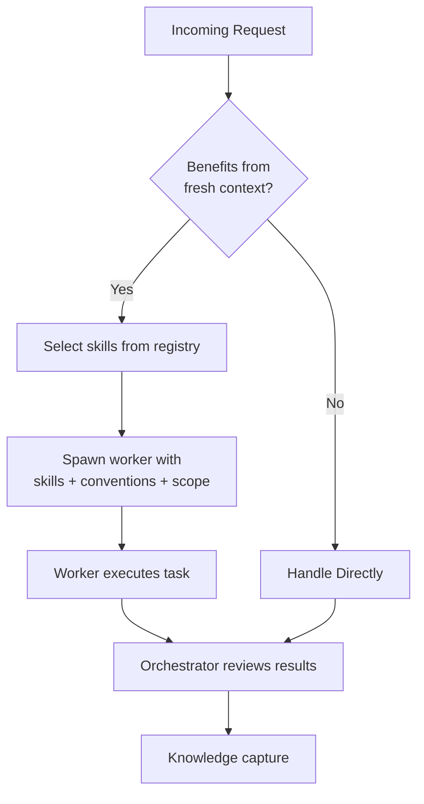
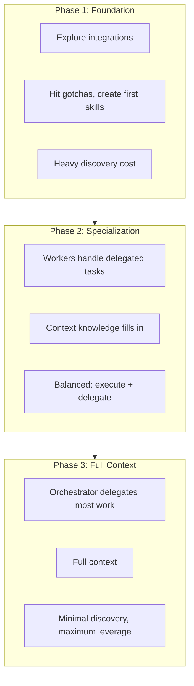

# How Delegation Works

Delegation is one of the harness's core functions — see [How It Works](how-it-works.md) for the full architecture overview.

## Delegation

The orchestrator delegates work to worker agents — ephemeral context windows loaded with curated skills and conventions per-task. For compound requests, the orchestrator spawns multiple workers in parallel for independent subtasks and keeps dependency-gated steps sequential. For measured cost impact, see [Cost Evidence](../evidence/index.md).

| Orchestrator | Worker Agent |
|-------------|-------------|
| Understand user intent | Execute delegated task |
| Select relevant skills | Load what orchestrator specifies |
| Coordinate multi-worker flows | Stay within scope boundaries |
| Handle knowledge capture | Report gotchas and findings |

### Knowledge-First Gating

Before spawning a worker, the orchestrator searches the knowledge base. If results directly answer the question, the orchestrator responds without delegating — avoiding unnecessary worker overhead. Workers are spawned only when execution, fresh context, or parallelism is needed.

### Subagent Context Contract

Workers receive what the orchestrator specifies: task description, skill file paths, convention file paths, and scope boundaries. `docs/context/agent-rules.md` is injected into the orchestrator's session banner; workers receive conventions and skills selected by the orchestrator per-task.

### Per-Platform Model Configuration

Worker agent tiers (`lore-worker`, `lore-worker-fast`, `lore-worker-powerful`) and their models are configured via `subagentDefaults` in `.lore/config.json` — not via agent frontmatter. See [Configuration: subagentDefaults](../reference/configuration.md#subagentdefaults).

## Session Acceleration

## See Also

- [How It Works](how-it-works.md) — full system architecture and harness engineering
- [Hook Architecture](hook-architecture.md) — how hooks reinforce delegation patterns
- [Working with Lore](../guides/working-with-lore.md) — practical delegation patterns
