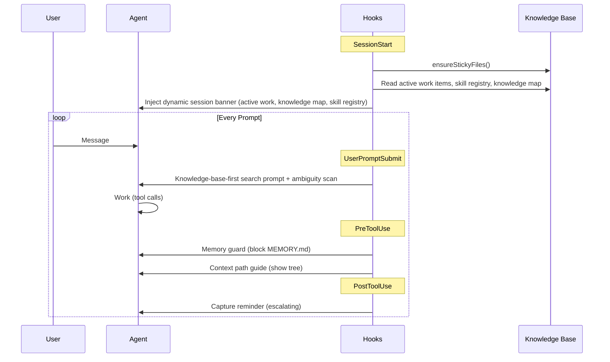

# Hook Architecture

Lore's hook system shapes agent behavior across the session lifecycle. Shared logic lives in `.lore/lib/`, with thin adapters for each platform. This page covers the shared foundation — see the [platform pages](../reference/platforms/index.md) for per-platform hook lists, configuration, and coverage gaps.

## Hook Lifecycle

## Module Layout

```mermaid
flowchart TB
    subgraph lib[".lore/lib/ (shared core)"]
        banner["banner.js<br/>Banner assembly"]
        tree["tree.js<br/>ASCII tree builder"]
        config["config.js<br/>Config reader"]
        sticky["sticky.js<br/>Sticky file scaffold"]
        tracker["tracker.js<br/>Tool classification"]
        guard["memory-guard.js<br/>MEMORY.md protection"]
        frontmatter["frontmatter.js<br/>YAML frontmatter parser"]
        genagents["generate-agents.js<br/>Agent file generation"]
        linkedrw["linked-rewrite.js<br/>Cross-repo path rewrite"]
        debug["debug.js<br/>Debug logging"]
        hooklog["hook-logger.js<br/>Event logging"]
    end

    subgraph claude["Claude Code (.lore/hooks/)"]
        cc_si[session-init.js]
        cc_pp[prompt-preamble.js]
        cc_pm[protect-memory.js]
        cc_cg[convention-guard.js]
        cc_fg[harness-guard.js]
        cc_kt[knowledge-tracker.js]
        cc_cp[context-path-guide.js]
        cc_sg[search-guard.js]
    end

    subgraph cursor["Cursor (.cursor/hooks/ + .cursor/mcp/)"]
        cu_si[session-init.js]
        cu_cn[capture-nudge.js]
        cu_cf[compaction-flag.js]
        cu_ft[failure-tracker.js]
        cu_pm[protect-memory.js]
        cu_kt[knowledge-tracker.js]
        cu_mcp[lore-server.js<br/>MCP: lore_check_in, lore_context, lore_write_guard]
    end

    subgraph opencode["OpenCode (.opencode/plugins/)"]
        oc_si[session-init.js]
        oc_pm[protect-memory.js]
        oc_cg[convention-guard.js]
        oc_fg[harness-guard.js]
        oc_kt[knowledge-tracker.js]
        oc_cp[context-path-guide.js]
        oc_sg[search-guard.js]
    end

    cc_si & cu_si & oc_si --> banner
    banner --> tree & config & sticky & frontmatter
    cc_si --> genagents
    cu_mcp --> linkedrw
    cc_kt & cu_kt & oc_kt --> tracker
    cu_cn --> tracker & config
    cu_mcp --> banner & tracker & config
    cc_pm & cu_pm & oc_pm --> guard
    cc_cg & cc_fg & oc_cg & oc_fg --> guard & config
    cc_cp & oc_cp --> banner
    cc_sg & oc_sg --> config
    tracker & guard & tree & config --> debug
    cc_si & cu_si & oc_si & cc_kt & cu_kt & oc_kt & cu_cn --> hooklog
```

## Banner-Loaded Skills

`session-init.js` inlines skills with `banner-loaded: true` in frontmatter.

## Platform Adapters

Each platform has a different hook API. Adapters translate between the platform's interface and the shared `lib/` functions.

| Platform | Adapter Style | Hook Count | Details |
|----------|--------------|:----------:|---------|
| Claude Code | Subprocess per event | 8 | [Claude Code](../reference/platforms/claude-code.md) |
| Cursor | Subprocess + MCP server | 6 + MCP | [Cursor](../reference/platforms/cursor.md) |
| OpenCode | Long-lived ESM plugins | 7 | [OpenCode](../reference/platforms/opencode.md) |

See [Platform Overview](../reference/platforms/index.md) for the full feature matrix.

## Hook Behavior Notes

| Hook | Trigger | What it does |
|------|---------|-------------|
| `session-init.js` | SessionStart | Assembles the dynamic session banner (work items, knowledge map, skill registry) |
| `harness-guard.js` | PreToolUse (writes) | Enforces hub vs. linked-repo boundaries |
| `context-path-guide.js` | PreToolUse (writes to `docs/`) | Shows knowledge map tree to guide placement |
| `search-guard.js` | PreToolUse (reads) | Nudges toward semantic search when sidecar is available |
| `ensure-structure.sh` | SessionStart | Creates stub `index.md` files for empty knowledge directories |

**Tool counter reset:** Read-only tools and knowledge writes reset the Bash command counter to 0. Capture nudges only accumulate against consecutive shell commands.

## See Also

- [How It Works](how-it-works.md) — full system architecture and harness engineering
- [Security](security.md) — how convention-guard enforces security at write time
- [Platform Overview](../reference/platforms/index.md) — per-platform hook lists and feature matrix
