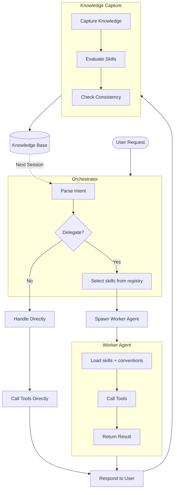
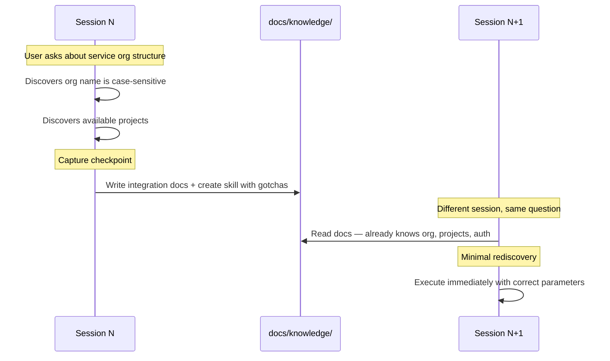
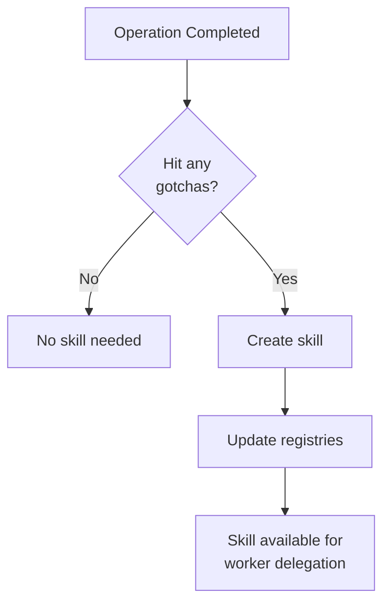

# How It Works

Every session starts from zero. Lore is the harness that changes that.

## Harness Engineering

Prompt engineering is about crafting individual prompts. [Context engineering](https://www.anthropic.com/engineering/effective-context-engineering-for-ai-agents) is about curating what goes into the context window — what Andrej Karpathy calls "the delicate art and science of filling the context window with just the right information for the next step." Lore does both, but they're means to an end. The actual product is the **harness**: the hooks, delegation patterns, worker tiers, capture lifecycle, semantic search, skill system, and the rules that govern how all of it interacts.

This distinction matters because it changes what you optimize for. Prompt engineering optimizes for a single interaction. Context engineering optimizes for a single session. Harness engineering optimizes for **all sessions** — the system that makes every future session better than the last.

### The emerging discipline

The term "harness engineering" entered the industry vocabulary in early 2026 when OpenAI's Codex team [published five principles](https://openai.com/index/harness-engineering/) from building a million-line codebase entirely with agents. Their core finding: the engineering shifted from writing code to designing environments — making knowledge accessible in the repo, enforcing architectural constraints mechanically rather than through documentation, and giving agents concise structural maps instead of exhaustive manuals.

Birgitta Bockeler, writing on [martinfowler.com](https://martinfowler.com/articles/exploring-gen-ai/harness-engineering.html), formalized harness engineering as three components: **context engineering** (curating what the agent sees), **architectural constraints** (deterministic linters and structural tests that enforce boundaries), and **entropy management** (agents that periodically find inconsistencies and violations). Her argument: maintainable AI-generated code requires trading unlimited generative flexibility for standardized, enforceable patterns.

These ideas build on earlier groundwork. Anthropic's Applied AI team described [context engineering patterns](https://www.anthropic.com/engineering/effective-context-engineering-for-ai-agents) for agents — subagent architectures where specialized workers handle focused tasks with clean context windows, progressive disclosure that loads knowledge on demand rather than upfront, and structured note-taking that persists memory outside the context window. Karpathy's [LLM-as-operating-system metaphor](https://karpathy.bearblog.dev/year-in-review-2025/) frames the same problem from the infrastructure side: the LLM is the CPU, the context window is RAM, and something needs to play the role of OS — managing memory, orchestrating processes, and supplying the right data at the right time.

### How Lore implements it

Lore brings harness engineering to the desktop — a single `npx create-lore` gives you the scaffolding that these teams built internally.

| Harness principle | Industry reference | Lore implementation |
|---|---|---|
| Knowledge the agent can't see doesn't exist | OpenAI | Git-tracked knowledge base (`docs/`), semantic search, session banner with knowledge map |
| Mechanical enforcement over documentation | OpenAI, Bockeler | Pre-tool-use hooks enforce conventions before writes land; `validate-consistency.sh` catches drift |
| Sub-agent architectures with focused context | Anthropic | Orchestrator delegates to tiered workers (Opus reasons, Haiku executes) — [59% cheaper](../evidence/index.md) at steady state |
| Progressive disclosure and lazy loading | Anthropic | Skills and docs load on demand; only the knowledge map appears at session start |
| Structured note-taking and persistent memory | Anthropic | Capture workflow routes knowledge to skills, environment docs, and runbooks — all git-tracked |
| Entropy management | Bockeler | Consistency validation, convention guards, escalating capture reminders |
| Architectural context mapping | OpenAI | Convention docs, agent-rules, environment mapping — concise structure, not exhaustive manuals |

The difference from these reference implementations: they describe harness engineering for a single application repo or a single team's internal tooling. Lore is the harness itself, packaged as infrastructure that works across repos, platforms, and sessions — with the knowledge compounding over time rather than starting from zero.

## System Architecture

## Knowledge Capture

Every session produces knowledge as a byproduct — endpoints, gotchas, org structure, tool parameters. Post-tool-use reminders encourage the agent to extract that knowledge into persistent documentation. When an operation produces non-obvious knowledge, it becomes a skill. The orchestrator finds relevant skills by name and description when delegating related tasks.

### The Capture-and-Reuse Loop

### Ownership

See [Platform Overview: Sync Boundaries](../reference/platforms/index.md#sync-boundaries) for the `lore-*` prefix convention and what sync overwrites.

### How Skills Grow

Skills are created from gotchas encountered during work. Lore ships with built-in workers (`lore-worker` tiers and `lore-explore`) — dynamic, ephemeral agents that are spawned per-task with specific conventions and skills to load, then dissolved after the task completes.

For the full capture routing table, see [Knowledge Routing Reference](../reference/commands.md).

See [How Delegation Works](delegation.md) for the orchestrator-worker model, worker tiers, and session acceleration.

## Context Efficiency

Lore uses indirection — telling the agent *where to find things* rather than loading all knowledge into context at session start.

| Layer | What It Contains |
|-------|------------------|
| `.lore/instructions.md` | Harness rules, knowledge routing, naming conventions |
| Session start: harness | Operating principles, available workers, active roadmaps/plans |
| Session start: project context | Operator customization from `docs/context/agent-rules.md` |
| Session start: operator profile | Identity and preferences from `docs/knowledge/local/operator-profile.md` (gitignored) |
| Session start: conventions | Coding and docs standards from `docs/context/conventions/` |
| Session start: knowledge map | Directory tree of `docs/` and `.lore/skills/` |
| Session start: local memory | Scratch notes from `.lore/memory.local.md` (gitignored) |
| Per-prompt reinforcement | Delegation + knowledge discovery + work tracking nudges |
| Post-tool-use reinforcement | Capture reminders with escalating urgency |
| Skills and docs | Loaded on-demand when invoked or needed |

**Static vs. dynamic banner split:** Conventions, agent-rules, and project context are baked into `CLAUDE.md` at generation time — these are stable and benefit from prompt cache hits. Active work items, the knowledge map, and the skill registry are injected by the `SessionStart` hook each session, so they stay current without regenerating `CLAUDE.md`.

When the Docker sidecar is running, the session banner includes a semantic search URL. Agents query by topic to find relevant docs and skills without loading the full directory tree.

## Hook Architecture

Hooks fire at key lifecycle events — session start, prompt submit, pre-tool-use, post-tool-use, and post-tool-use-failure. Shared logic in `.lore/lib/` keeps behavior consistent; each platform has thin adapters that translate between its hook API and the shared modules. Hook implementations vary by platform — see [Hook Architecture](hook-architecture.md) for the shared lib deep-dive and [Platform Overview](../reference/platforms/index.md) for per-platform specifics.

For limitations and known gaps, see [Production Readiness](production-readiness.md#known-limitations).

## See Also

- [Delegation](delegation.md) — orchestrator-worker model and session acceleration
- [Hook Architecture](hook-architecture.md) — lifecycle events, shared lib, platform adapters
- [Security](security.md) — how security is enforced across every write
- [Getting Started](../getting-started/index.md) — hands-on introduction
