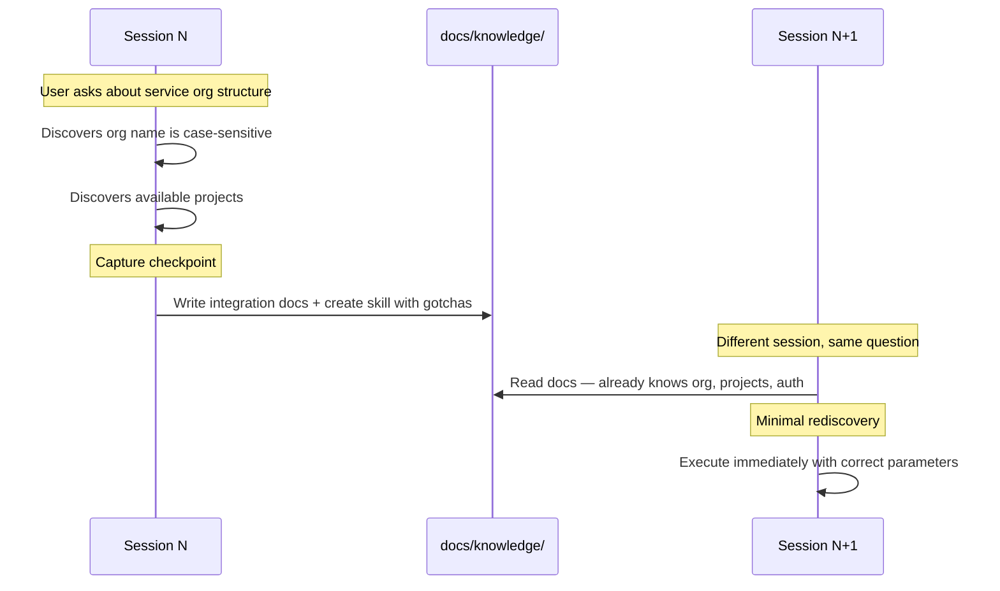
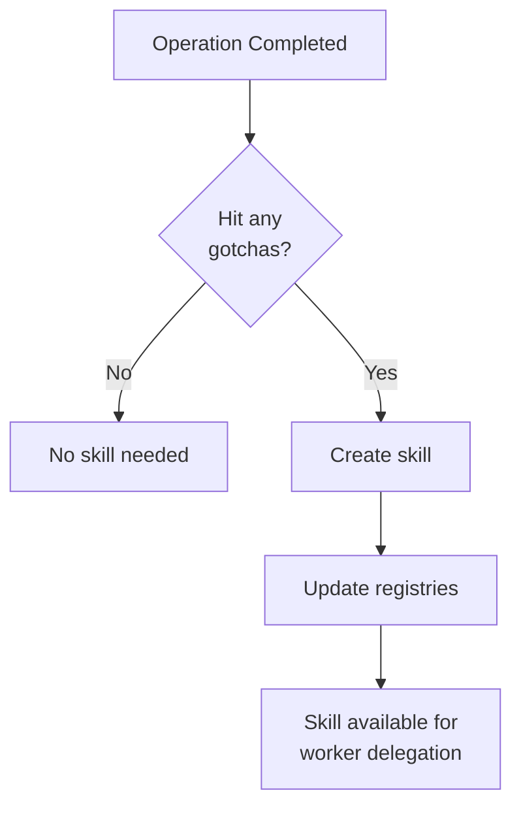

# How It Works

Every session starts from zero. Lore is the harness that changes that.

## Harness Engineering

Prompt engineering optimizes a single interaction. Context engineering optimizes a single session. Harness engineering optimizes **all sessions** — the system that makes every future session better than the last.

The harness is everything that wraps the agent: hooks, delegation patterns, worker tiers, capture lifecycle, semantic search, the skill system, and the rules governing how they interact. A single `npx create-lore` gives you the scaffolding.

| What Lore does | How |
|---|---|
| Make knowledge findable | Git-tracked knowledge base (`docs/`), semantic search, session banner with knowledge map |
| Enforce conventions mechanically | Pre-tool-use hooks validate before writes land; `validate-consistency.sh` catches drift |
| Delegate with focused context | Orchestrator routes to tiered workers (Opus reasons, Haiku executes) — [59% cheaper](../evidence/index.md) at steady state |
| Load knowledge on demand | Skills and docs load when needed; only the knowledge map appears at session start |
| Capture knowledge automatically | Gotchas become skills, environment facts become docs, procedures become runbooks — all git-tracked |
| Manage entropy | Consistency validation, convention guards, escalating capture reminders |

!!! note "Further reading"
    The term gained traction in early 2026: [OpenAI's Codex team](https://openai.com/index/harness-engineering/) on designing environments over writing code, [Birgitta Bockeler](https://martinfowler.com/articles/exploring-gen-ai/harness-engineering.html) on context engineering + architectural constraints + entropy management, [Anthropic](https://www.anthropic.com/engineering/effective-context-engineering-for-ai-agents) on subagent architectures and progressive disclosure, and [Karpathy](https://karpathy.bearblog.dev/year-in-review-2025/) on the LLM-as-operating-system metaphor.

## System Architecture

## Knowledge Capture

Every session produces knowledge as a byproduct — endpoints, gotchas, org structure, tool parameters. Post-tool-use reminders encourage the agent to extract that knowledge into persistent documentation. When an operation produces non-obvious knowledge, it becomes a skill. The orchestrator finds relevant skills by name and description when delegating related tasks.

### The Capture-and-Reuse Loop

### Ownership

See [Platform Overview: Sync Boundaries](../reference/platforms/index.md#sync-boundaries) for the `lore-*` prefix convention and what sync overwrites.

### How Skills Grow

Skills are created from gotchas encountered during work. Lore ships with built-in workers (`lore-worker` tiers and `lore-explore`) — dynamic, ephemeral agents that are spawned per-task with specific conventions and skills to load, then dissolved after the task completes.

For the full capture routing table, see [Knowledge Routing Reference](../reference/commands.md).

See [How Delegation Works](delegation.md) for the orchestrator-worker model, worker tiers, and session acceleration.

## Context Efficiency

Lore uses indirection — telling the agent *where to find things* rather than loading all knowledge into context at session start.

| Layer | What It Contains |
|-------|------------------|
| `.lore/instructions.md` | Harness rules, knowledge routing, naming conventions |
| Session start: harness | Operating principles, available workers, active roadmaps/plans |
| Session start: project context | Operator customization from `docs/context/agent-rules.md` |
| Session start: operator profile | Identity and preferences from `docs/knowledge/local/operator-profile.md` (gitignored) |
| Session start: conventions | Coding and docs standards from `docs/context/conventions/` |
| Session start: knowledge map | Directory tree of `docs/` and `.lore/skills/` |
| Session start: local memory | Scratch notes from `.lore/memory.local.md` (gitignored) |
| Per-prompt reinforcement | Delegation + knowledge discovery + work tracking nudges |
| Post-tool-use reinforcement | Capture reminders with escalating urgency |
| Skills and docs | Loaded on-demand when invoked or needed |

**Static vs. dynamic banner split:** Conventions, agent-rules, and project context are baked into `CLAUDE.md` at generation time — these are stable and benefit from prompt cache hits. Active work items, the knowledge map, and the skill registry are injected by the `SessionStart` hook each session, so they stay current without regenerating `CLAUDE.md`.

When the Docker sidecar is running, the session banner includes a semantic search URL. Agents query by topic to find relevant docs and skills without loading the full directory tree.

## Hook Architecture

Hooks fire at key lifecycle events — session start, prompt submit, pre-tool-use, post-tool-use, and post-tool-use-failure. Shared logic in `.lore/lib/` keeps behavior consistent; each platform has thin adapters that translate between its hook API and the shared modules. Hook implementations vary by platform — see [Hook Architecture](hook-architecture.md) for the shared lib deep-dive and [Platform Overview](../reference/platforms/index.md) for per-platform specifics.

For limitations and known gaps, see [Production Readiness](production-readiness.md#known-limitations).

## See Also

- [Delegation](delegation.md) — orchestrator-worker model and session acceleration
- [Hook Architecture](hook-architecture.md) — lifecycle events, shared lib, platform adapters
- [Security](security.md) — how security is enforced across every write
- [Getting Started](../getting-started/index.md) — hands-on introduction
