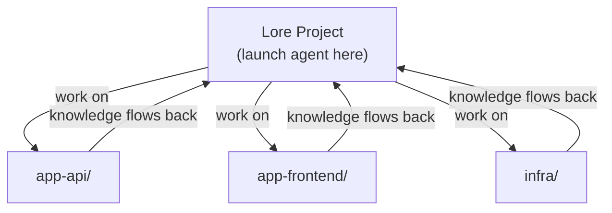

# Working Across Repos

Lore is designed as a hub — one Lore project that tracks and performs work across all your other repositories.

## Why a Central Hub

Without a central project, you have two options — both worse:

1. **Lore in every repo** — knowledge fragments. The same gotcha gets rediscovered per-repo. No cross-project context ("repo A's API connects to repo B's service"). Work repos get cluttered with skills, docs, and hooks that have nothing to do with the application.
2. **No Lore at all** — the agent starts cold every session. No persistent skills, no context docs, no work tracking.

A single Lore project avoids both problems. Knowledge compounds in one place, work repos stay clean, and cross-project context builds naturally.

## How It Works



1. **Launch your agent from the Lore project directory.** This loads `CLAUDE.md`, hooks, and settings — everything the agent needs to operate with persistent memory.

2. **Tell it to work on other repos.** The agent reads, writes, and runs commands across repos using absolute paths. No `cd` needed.

    ```
    "Fix the auth bug in ~/projects/app-api"
    "Run the tests in ~/projects/app-frontend"
    "Update the Terraform config in ~/projects/infra"
    ```

3. **Knowledge captures back to Lore.** Gotchas become skills, endpoints go to context docs, multi-step procedures become runbooks — all stored in the Lore project, available next session.

## What Crosses Repo Boundaries

The agent operates on files and commands anywhere on your machine. There's no path restriction.

| Operation | How it works |
|-----------|-------------|
| Read/write files | Absolute paths (`/home/you/projects/app-api/src/auth.ts`) |
| Git operations | `git -C /path/to/repo status`, `git -C /path/to/repo commit ...` |
| Run tests | `cd /path/to/repo && npm test` |
| Search code | Grep/Glob with path parameter pointing at any directory |

## What Stays in Lore

| Artifact | Example |
|----------|---------|
| **Skills** | "This API requires case-sensitive org names" |
| **Context docs** | Repo inventory, service endpoints, relationships |
| **Runbooks** | "How to deploy app-api to staging" |
| **Roadmaps/plans** | Work that spans multiple repos |

None of this pollutes your work repos.

## The One Rule

**Always launch your agent from the Lore project directory.** That's what loads the operating principles, hooks, and accumulated knowledge. If you launch from a work repo instead, the agent starts without Lore's context.

```bash
cd ~/projects/my-lore-project
claude
```

Then work on whatever repos you need from there.
