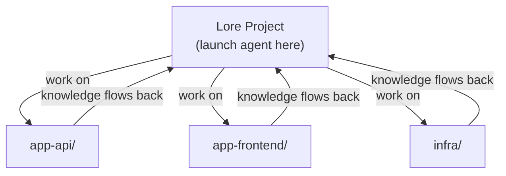

# Working Across Repos

Lore is designed as a hub — one Lore project that tracks and performs work across all your other repositories.

## Why a Central Hub

Without a central project, you have two options — both worse:

1. **Lore in every repo** — knowledge fragments. The same gotcha gets rediscovered per-repo. No cross-project context ("repo A's API connects to repo B's service"). Work repos get cluttered with skills, docs, and hooks that have nothing to do with the application.
2. **No Lore at all** — the agent starts cold every session. No persistent skills, no context docs, no work tracking.

A single Lore project avoids both problems. Knowledge compounds in one place, work repos stay clean, and cross-project context builds naturally.

## How It Works



1. **Launch your agent from the Lore project directory.** This loads instructions, hooks, and settings — everything the agent needs to operate with persistent memory.

2. **Tell it to work on other repos.** The agent reads, writes, and runs commands across repos using absolute paths. No `cd` needed for file operations.

    ```
    "Fix the auth bug in ~/projects/app-api"
    "Run the tests in ~/projects/app-frontend"
    "Update the Terraform config in ~/projects/infra"
    ```

3. **Knowledge captures back to Lore.** Gotchas become skills, endpoints go to context docs, multi-step procedures become runbooks — all stored in the Lore project, available next session.

## What Crosses Repo Boundaries

The agent operates on files and commands anywhere on your machine. There's no path restriction.

| Operation | How it works |
|-----------|-------------|
| Read/write files | Absolute paths (`/home/you/projects/app-api/src/auth.ts`) |
| Git operations | `git -C /path/to/repo status`, `git -C /path/to/repo commit ...` |
| Run tests | `cd /path/to/repo && npm test` |
| Search code | Grep/Glob with path parameter pointing at any directory |

## What Stays in Lore

| Artifact | Example |
|----------|---------|
| **Skills** | "This API requires case-sensitive org names" |
| **Knowledge docs** | Repo inventory, service endpoints, relationships |
| **Runbooks** | "How to deploy app-api to staging" |
| **Roadmaps/plans** | Work that spans multiple repos |

None of this pollutes your work repos.

## The One Rule

**Always launch your agent from the Lore project directory.** That's what loads the operating principles, hooks, and accumulated knowledge. If you launch from a work repo instead, the agent starts without Lore's context.

```bash
cd ~/projects/my-lore-project
claude       # Claude Code
cursor .     # Cursor (open the project)
opencode     # OpenCode
```

Then work on whatever repos you need from there.

For IDE workflows where opening the Lore project is impractical, see [IDE Workflow: lore link](#ide-workflow-lore-link) below.

## IDE Workflow: lore link

The One Rule works well for CLI tools like Claude Code and OpenCode — you launch from a directory, and that's that. For IDEs like Cursor, opening the Lore project means losing the work repo's file tree, git integration, and search. You're editing your app but navigating Lore's directory structure.

`lore link` resolves this. Run it once from the hub and it generates lightweight configs in the work repo that point hooks back to the hub via `LORE_HUB`. You open the work repo in your IDE with full file tree, git, and search — and hooks still fire from the hub.

### Usage

```bash
# From your Lore project directory:
bash scripts/lore-link.sh ~/projects/my-app          # Link a work repo
bash scripts/lore-link.sh --unlink ~/projects/my-app  # Remove the link
bash scripts/lore-link.sh --list                       # Show linked repos (with stale detection)
bash scripts/lore-link.sh --refresh                    # Regenerate configs in all linked repos
```

### What It Generates

In the target repo, `lore link` creates:

- **Claude Code** — `.claude/settings.json` with hooks pointing to the hub
- **Cursor** — `.cursor/hooks.json` + `.cursor/rules/lore.mdc` pointing to the hub
- **OpenCode** — `.opencode/plugins/` wrappers + `.opencode/commands/` + `opencode.json` pointing to the hub
- **Instructions** — `CLAUDE.md` and `.cursorrules` copied from the hub
- **Marker** — `.lore` file recording the hub path and link timestamp

All generated files are added to the target repo's `.gitignore` automatically. Existing files are backed up to `.bak` before overwriting.

### Knowledge Still Centralizes

Even when working from a linked repo, knowledge captures back to the hub. Skills, context docs, and runbooks all write to the hub directory — the work repo stays clean.

### When to Use Which

| Scenario | Approach |
|----------|----------|
| CLI agent (Claude Code, OpenCode) | **The One Rule** — launch from the Lore project |
| IDE agent (Cursor, or IDE-mode Claude Code) | **lore link** — link the work repo, open it in your IDE |
| Quick cross-repo task from the hub | **The One Rule** — just reference the path |

### After Framework Updates

Run `--refresh` after `/lore-update` to regenerate configs in all linked repos with the latest hooks:

```bash
bash scripts/lore-link.sh --refresh
```
