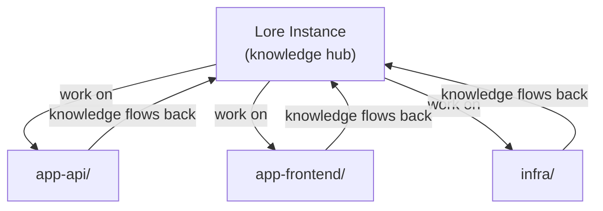

# Working Across Repos

Lore is designed as a hub — one Lore instance that tracks and performs work across all your other repositories.

## How It Works


```mermaid
flowchart TD
    Lore["Lore Instance<br/>(knowledge hub)"]
    Lore -->|work on| A["app-api/"]
    Lore -->|work on| B["app-frontend/"]
    Lore -->|work on| C["infra/"]

    A -->|knowledge flows back| Lore
    B -->|knowledge flows back| Lore
    C -->|knowledge flows back| Lore
```

1. **Connect your agent to the Lore instance.** CLI agents launch from here directly. IDE agents use [`/lore-link`](#ide-workflow-lore-link) to work from the code repo with hooks firing from the hub.

2. **Work on other repos.** The agent reads, writes, and runs commands across repos using absolute paths.

    ```
    "Fix the auth bug in ~/projects/app-api"
    "Run the tests in ~/projects/app-frontend"
    "Update the Terraform config in ~/projects/infra"
    ```

3. **Knowledge captures back to Lore.** Gotchas become skills, endpoints go to context docs, multi-step procedures become runbooks — all stored in the Lore instance, available next session.

## What Crosses Repo Boundaries

The agent operates on files and commands anywhere on your machine. There's no path restriction.

| Operation | How it works |
|-----------|-------------|
| Read/write files | Absolute paths (`/home/you/projects/app-api/src/auth.ts`) |
| Git operations | `git -C /path/to/repo status`, `git -C /path/to/repo commit ...` |
| Run tests | `cd /path/to/repo && npm test` |
| Search code | Grep/Glob with path parameter pointing at any directory |

## What Stays in Lore

| Artifact | Example |
|----------|---------|
| **Skills** | "This API requires case-sensitive org names" |
| **Knowledge docs** | Repo inventory, service endpoints, relationships |
| **Runbooks** | "How to deploy app-api to staging" |
| **Roadmaps/plans** | Work that spans multiple repos |

None of these artifacts pollute your work repos.

## Two Workflows

Choose based on your agent and tooling:

**CLI agents (Claude Code, OpenCode):** Launch from the Lore instance. This loads instructions, hooks, and accumulated knowledge. Then reference any other repo by path.

```bash
cd ~/projects/my-lore-project
claude       # Claude Code
opencode     # OpenCode
```

**IDE agents (Cursor):** Use [`/lore-link`](#ide-workflow-lore-link) to work from your code repo. You keep full file tree, git integration, and search — hooks still fire from the hub.

## IDE Workflow: /lore-link

### Usage

```
/lore-link ~/projects/my-app          # Link a work repo
/lore-link --unlink ~/projects/my-app  # Remove the link
/lore-link --list                       # Show linked repos (with stale detection)
/lore-link --refresh                    # Regenerate configs in all linked repos
```

### What It Generates

In the target repo, `/lore-link` creates:

- **Claude Code** — `.claude/settings.json` with hooks pointing to the hub
- **Cursor** — `.cursor/hooks.json` + `.cursor/mcp.json` + `.cursor/rules/lore-*.mdc` pointing to the hub
- **OpenCode** — `.opencode/plugins/` wrappers (3 of 5 hub plugins: session-init, protect-memory, knowledge-tracker) + `.opencode/commands/` + `opencode.json` pointing to the hub
- **Instructions** — `CLAUDE.md` rewritten from hub's `.lore/instructions.md`
- **Link record** — `.lore/links` in the hub repo (a JSON array) updated with the linked repo path and timestamp

All generated files are added to the target repo's `.gitignore` automatically. Existing files are backed up with a `.bak` extension before overwriting.

### Knowledge Still Centralizes

Even when working from a linked repo, knowledge captures back to the hub. Skills, context docs, and runbooks all write to the hub directory — the work repo stays clean.

### When to Use Which

| Scenario | Approach |
|----------|----------|
| CLI agent (Claude Code, OpenCode) | Launch from the Lore instance |
| IDE agent (Cursor, or IDE-mode Claude Code) | `/lore-link` — link the work repo, open it in your IDE |
| Quick cross-repo task from the hub | Launch from the Lore instance, reference the path |

### After Harness Updates

Run `/lore-link --refresh` after `/lore-update` to regenerate configs in all linked repos with the latest hooks.

## Team Topologies

| Topology | How it works |
|----------|-------------|
| Shared instance | One Lore instance in git. Team collaborates via branches, PRs, code review on `docs/` and `.lore/skills/`. |
| Instance per developer | Each developer runs their own instance. Share skills by pushing/pulling between repos. |
| Hub + linked repos | One hub with `/lore-link` per work repo. Centralized knowledge, decentralized development. |

The single-developer model is the primary use case — team patterns follow naturally from it.
