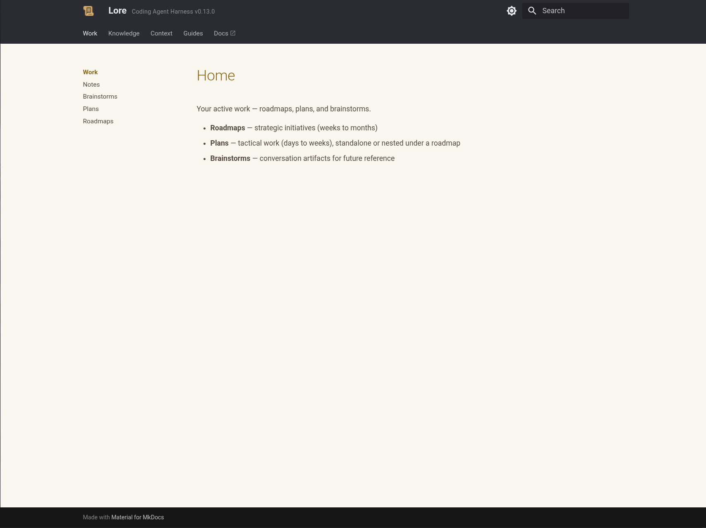
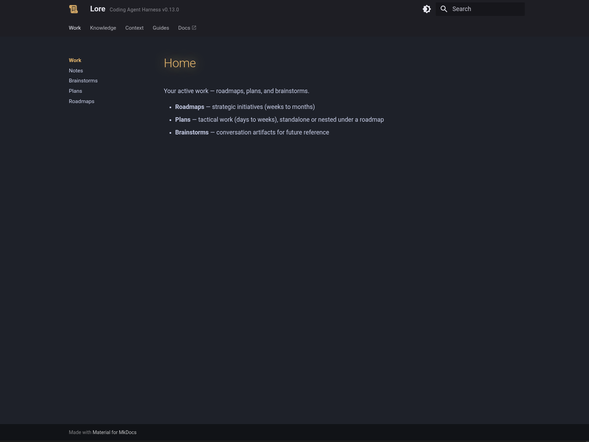

# Docs UI & Semantic Search

A single Docker container that runs locally alongside the agent, providing semantic search over your knowledge base and a live-reloading docs site.

=== "Light"

    

=== "Dark"

    

## What You Get

### Semantic Search

A local HTTP API that indexes all knowledge files, skills, work items, and agents. Agents query by topic or meaning — not just filename — and get back ranked file paths. Hooks use the API automatically when the container is running.

Without Docker, agents fall back to Grep/Glob (keyword search).

### MkDocs UI

A live-reloading site at `localhost:PORT` that renders your full knowledge base as a browsable site. Useful for seeing exactly what the agent sees, verifying conventions, and navigating large knowledge bases without opening individual files.

## Setup

**Prerequisite:** Docker (Docker Desktop or Docker Engine).

```bash
/lore-docker          # start
/lore-docker stop     # stop
/lore-docker status   # health check
```

On first start, Docker pulls the image (`lorehq/lore-docker:latest`) and loads the semantic models — allow 1–3 minutes. The docs site comes up first; semantic search becomes available after model loading completes. Subsequent starts are fast — image and volumes are cached.

## Ports & Configuration

Ports are auto-computed per project (hash of project name, range 9001–9999) so multiple projects never collide. Semantic search runs on docs port + 1 (e.g. docs on 9184, semantic search on 9185).

Override in `.lore/config.json`:

```json
{
  "docker": {
    "site":   { "port": 9010 },
    "search": { "port": 10010 }
  }
}
```

`/lore-docker start` writes the resolved ports to `.lore/config.json` automatically after the first successful start.

## Without Docker

Agents fall back to Grep/Glob silently — no configuration needed. The fallback works reliably for small-to-medium knowledge bases; for a brand-new project with minimal docs, it's fine. Once you have more than a few dozen knowledge files, the sidecar pays for itself in retrieval quality.

## When to Start the Sidecar

Start it at project setup and leave it running. Semantic search improves knowledge retrieval as your docs grow — the value compounds over time.

## Environment Variables

| Variable | Default | Description |
|----------|---------|-------------|
| `REPO_ROOT` | — | Set in `docker-compose.yml` to enable CLAUDE.md auto-regeneration. Required for the watcher to locate the instance root. |
| `WATCH_CLAUDEMD_DEBOUNCE_SECONDS` | `2.0` | Debounce delay before CLAUDE.md is regenerated after a file change. |

### CLAUDE.md Auto-Regeneration

When `REPO_ROOT` is set, the container watches `.lore/` and `docs/` for changes and automatically regenerates `CLAUDE.md`. This keeps the session banner in sync with edits to instructions, conventions, and context files without a manual `sync-platform-skills.sh` run.

### Panzoom for Images

The docs site enables panzoom on images: a full-screen button appears on hover, zoom works without a modifier key, and D2 diagrams are supported.

## Known Issues

- Model loading takes 30–60s on first start. The docs site appears before semantic search is ready. `/lore-docker status` reports semantic search health separately from site health.
- During bulk file edits, the file watcher may crash (editor temp files cause a race condition). Restart the container after bulk edits complete.
- The container creates a named Docker volume per project for the search index. First start triggers a full index build; subsequent starts are fast.
