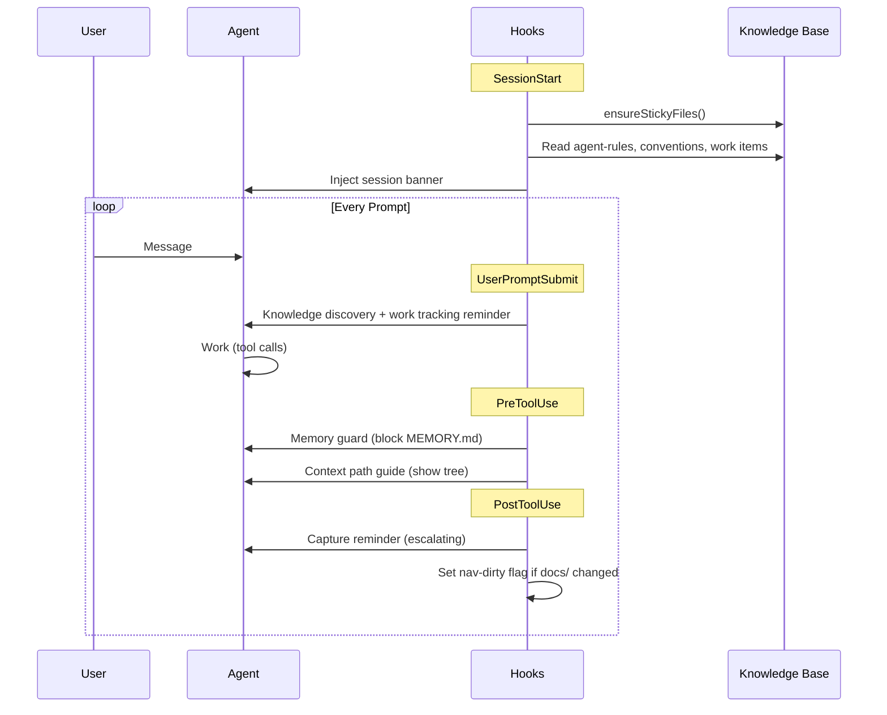

# Hook Architecture

Lore hooks into the agent's lifecycle at seven events. Shared logic lives in `lib/`, with thin adapters for each platform.

## Hook Lifecycle



## Module Layout

```mermaid
flowchart TB
    subgraph lib[".lore/lib/ (shared core)"]
        banner["banner.js<br/>Banner assembly"]
        tree["tree.js<br/>ASCII tree builder"]
        config["config.js<br/>Config reader"]
        sticky["sticky.js<br/>Sticky file scaffold"]
        tracker["tracker.js<br/>Tool classification"]
        guard["memory-guard.js<br/>MEMORY.md protection"]
        debug["debug.js<br/>Debug logging"]
        hooklog["hook-logger.js<br/>Event logging"]
    end

    subgraph claude["Claude Code (.lore/hooks/)"]
        cc_si[session-init.js]
        cc_pp[prompt-preamble.js]
        cc_pm[protect-memory.js]
        cc_cg[convention-guard.js]
        cc_fg[framework-guard.js]
        cc_kt[knowledge-tracker.js]
        cc_cp[context-path-guide.js]
    end

    subgraph cursor["Cursor (.cursor/hooks/ + .cursor/mcp/)"]
        cu_si[session-init.js]
        cu_cn[capture-nudge.js]
        cu_cf[compaction-flag.js]
        cu_ft[failure-tracker.js]
        cu_pm[protect-memory.js]
        cu_kt[knowledge-tracker.js]
        cu_mcp[lore-server.js<br/>MCP: lore_check_in, lore_context, lore_write_guard]
    end

    subgraph opencode["OpenCode (.opencode/plugins/)"]
        oc_si[session-init.js]
        oc_pm[protect-memory.js]
        oc_cg[convention-guard.js]
        oc_fg[framework-guard.js]
        oc_kt[knowledge-tracker.js]
        oc_cp[context-path-guide.js]
    end

    cc_si & cu_si & oc_si --> banner
    banner --> tree & config & sticky
    cc_kt & cu_kt & oc_kt --> tracker
    cu_cn --> tracker & config
    cu_mcp --> banner & tracker & config
    cc_pm & cu_pm & oc_pm --> guard
    cc_cg & cc_fg & oc_cg & oc_fg --> guard & config
    cc_cp & oc_cp --> banner
    tracker & guard & tree & config --> debug
    cc_si & cu_si & oc_si & cc_kt & cu_kt & oc_kt & cu_cn --> hooklog
```



## Banner-Loaded Skills

Skills with `banner-loaded: true` in their YAML frontmatter have their full body inlined into the session banner at startup. Use `banner-loaded: true` for high-priority skills that must always be in context without explicit loading.

```yaml
---
name: my-skill
banner-loaded: true
---
# Skill content inlined into every session banner
```

Standard skills (without `banner-loaded: true`) are listed by name in the knowledge map tree but not loaded automatically.

## Platform Adapters

Each platform has a different hook API. Adapters translate between the platform's interface and the shared `lib/` functions.

| Hook Point | Claude Code | Cursor | OpenCode |
|-----------|-------------|--------|----------|
| Session start | `SessionStart` | `sessionStart` | `SessionInit` |
| Per-prompt | `UserPromptSubmit` | -- | `chat.system.transform` |
| Memory guard | `PreToolUse` | `beforeReadFile` + `preToolUse` | `tool.execute.before` |
| Knowledge tracker | `PostToolUse` | `afterFileEdit` (silent) | `tool.execute.after` |
| Capture nudge | `PostToolUse` (in knowledge-tracker) | `beforeShellExecution` | `tool.execute.after` (in knowledge-tracker) |
| Context path guide | `PreToolUse` | -- | `tool.execute.before` |
| MCP tools | -- | `lore_check_in` + `lore_context` | -- |
| Compaction | `SessionStart` re-fires | `preCompact` flag | `session.compacting` |

Cursor does not display output from `afterFileEdit`, `postToolUseFailure`, or `preCompact` hooks to the agent, and has no per-prompt hook. The MCP server (`lore_check_in`, `lore_context`) compensates by providing on-demand access to nudges and the knowledge map.

See [Platform Support](platform-support.md) for the feature matrix and setup details.

## Hook Behavior Notes

### framework-guard.js

Detects whether the agent is operating in a Lore hub repo or a linked work repo. Enforces different guardrails in each context — hub repos block application code creation; linked repos block direct edits to hub knowledge files. Fires on `PreToolUse` for file write operations.

### context-path-guide.js

Fires when the agent accesses files under `docs/context/` or `docs/knowledge/`. Outputs a knowledge map tree to help the agent navigate to the right location for context reads and writes. Fires on `PreToolUse`.

### failure-tracker.js (Cursor)

Sets a flag when a tool use fails. The `capture-nudge.js` hook reads the flag in `beforeShellExecution` to deliver capture reminders when the agent transitions from a failed tool use to a shell command. The two-hook pattern compensates for Cursor not displaying `postToolUseFailure` output to the agent.

### ensure-structure.sh

Runs on `SessionStart`. Creates stub `index.md` files for any knowledge directories that don't have one. Prevents empty directory entries from appearing in the knowledge map without any navigation context.

### Read-only tool reset

When the agent uses a read-only tool (Read, Glob, Grep, WebFetch), the Bash command counter resets to 0 rather than incrementing. Capture nudges only accumulate against shell commands — reading files does not count toward the nudge or warn thresholds.
