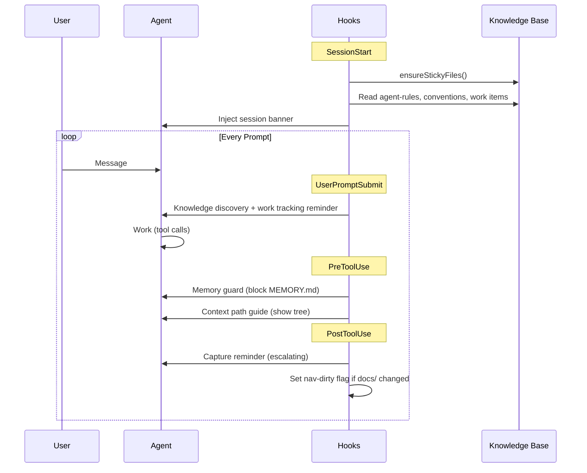

# Hook Architecture

Lore hooks into the agent's lifecycle at five points. Shared logic lives in `lib/`, with thin adapters for each platform.

## Hook Lifecycle

## Module Layout

```mermaid
flowchart TB
    subgraph lib["lib/ (shared core)"]
        banner["banner.js<br/>Banner assembly"]
        tree["tree.js<br/>ASCII tree builder"]
        config["config.js<br/>Config reader"]
        sticky["sticky.js<br/>Sticky file scaffold"]
        tracker["tracker.js<br/>Tool classification"]
        guard["memory-guard.js<br/>MEMORY.md protection"]
        debug["debug.js<br/>Debug logging"]
        hooklog["hook-logger.js<br/>Event logging"]
    end

    subgraph claude["Claude Code (hooks/)"]
        cc_si[session-init.js]
        cc_pp[prompt-preamble.js]
        cc_pm[protect-memory.js]
        cc_kt[knowledge-tracker.js]
        cc_cp[context-path-guide.js]
    end

    subgraph cursor["Cursor (.cursor/hooks/ + .cursor/mcp/)"]
        cu_si[session-init.js]
        cu_cn[capture-nudge.js]
        cu_cf[compaction-flag.js]
        cu_ft[failure-tracker.js]
        cu_pm[protect-memory.js]
        cu_kt[knowledge-tracker.js]
        cu_mcp[lore-server.js<br/>MCP: check_in, context, write_guard]
    end

    subgraph opencode["OpenCode (.opencode/plugins/)"]
        oc_si[session-init.js]
        oc_pm[protect-memory.js]
        oc_kt[knowledge-tracker.js]
        oc_cp[context-path-guide.js]
    end

    cc_si & cu_si & oc_si --> banner
    banner --> tree & config & sticky
    cc_kt & cu_kt & oc_kt --> tracker
    cu_cn --> tracker & config
    cu_mcp --> banner & tracker & config
    cc_pm & cu_pm & oc_pm --> guard
    cc_cp & oc_cp --> banner
    tracker & guard & tree & config --> debug
    cc_si & cu_si & oc_si & cc_kt & cu_kt & oc_kt & cu_cn --> hooklog
```

## Platform Adapters

Each platform has a different hook API. Adapters translate between the platform's interface and the shared `lib/` functions.

| Hook Point | Claude Code | Cursor | OpenCode |
|-----------|-------------|--------|----------|
| Session start | `SessionStart` | `sessionStart` | `SessionInit` |
| Per-prompt | `UserPromptSubmit` | -- | `chat.system.transform` |
| Memory guard | `PreToolUse` | `beforeReadFile` + `preToolUse` | `tool.execute.before` |
| Knowledge tracker | `PostToolUse` | `afterFileEdit` (silent) | `tool.execute.after` |
| Capture nudge | `PostToolUse` (in knowledge-tracker) | `beforeShellExecution` | `tool.execute.after` (in knowledge-tracker) |
| Context path guide | `PreToolUse` | -- | `tool.execute.before` |
| MCP tools | -- | `lore_check_in` + `lore_context` | -- |
| Compaction | `SessionStart` re-fires | `preCompact` flag | `session.compacting` |

Cursor does not display output from `afterFileEdit`, `postToolUseFailure`, or `preCompact` hooks to the agent, and has no per-prompt hook. The MCP server (`lore_check_in`, `lore_context`) compensates by providing on-demand access to nudges and the knowledge map.

See [Platform Support](platform-support.md) for the feature matrix and setup details.
