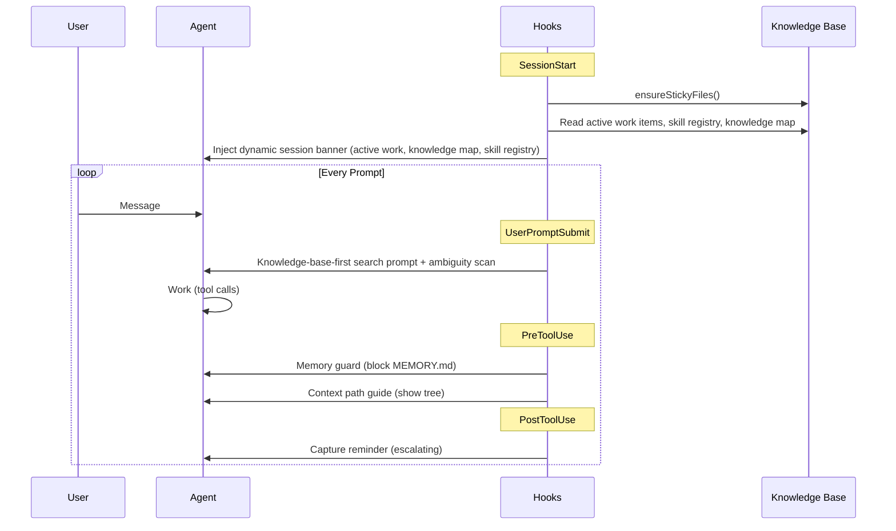

# Hook Architecture

Lore's hook system shapes agent behavior across the session lifecycle. Shared logic lives in `.lore/lib/`, with thin adapters for each platform. This page covers the shared foundation — see the [platform pages](platforms/index.md) for per-platform hook lists, configuration, and coverage gaps.

## Hook Lifecycle

```mermaid
sequenceDiagram
    participant User
    participant Agent
    participant Hooks
    participant KB as Knowledge Base

    Note over Hooks: SessionStart
    Hooks->>KB: ensureStickyFiles()
    Hooks->>KB: Read active work items, skill registry, knowledge map
    Hooks->>Agent: Inject dynamic session banner (active work, knowledge map, skill registry)

    loop Every Prompt
        User->>Agent: Message
        Note over Hooks: UserPromptSubmit
        Hooks->>Agent: Knowledge-base-first search prompt + ambiguity scan
        Agent->>Agent: Work (tool calls)

        Note over Hooks: PreToolUse
        Hooks->>Agent: Memory guard (block MEMORY.md)
        Hooks->>Agent: Context path guide (show tree)

        Note over Hooks: PostToolUse
        Hooks->>Agent: Capture reminder (escalating)
    end
```

## Module Layout

```mermaid
flowchart TB
    subgraph lib[".lore/lib/ (shared core)"]
        banner["banner.js<br/>Banner assembly"]
        tree["tree.js<br/>ASCII tree builder"]
        config["config.js<br/>Config reader"]
        sticky["sticky.js<br/>Sticky file scaffold"]
        tracker["tracker.js<br/>Tool classification"]
        guard["memory-guard.js<br/>MEMORY.md protection"]
        frontmatter["frontmatter.js<br/>YAML frontmatter parser"]
        genagents["generate-agents.js<br/>Agent file generation"]
        linkedrw["linked-rewrite.js<br/>Cross-repo path rewrite"]
        debug["debug.js<br/>Debug logging"]
        hooklog["hook-logger.js<br/>Event logging"]
    end

    subgraph claude["Claude Code (.lore/hooks/)"]
        cc_si[session-init.js]
        cc_pp[prompt-preamble.js]
        cc_pm[protect-memory.js]
        cc_cg[convention-guard.js]
        cc_fg[harness-guard.js]
        cc_kt[knowledge-tracker.js]
        cc_cp[context-path-guide.js]
        cc_sg[search-guard.js]
    end

    subgraph cursor["Cursor (.cursor/hooks/ + .cursor/mcp/)"]
        cu_si[session-init.js]
        cu_cn[capture-nudge.js]
        cu_cf[compaction-flag.js]
        cu_ft[failure-tracker.js]
        cu_pm[protect-memory.js]
        cu_kt[knowledge-tracker.js]
        cu_mcp[lore-server.js<br/>MCP: lore_check_in, lore_context, lore_write_guard]
    end

    subgraph opencode["OpenCode (.opencode/plugins/)"]
        oc_si[session-init.js]
        oc_pm[protect-memory.js]
        oc_cg[convention-guard.js]
        oc_fg[harness-guard.js]
        oc_kt[knowledge-tracker.js]
        oc_cp[context-path-guide.js]
    end

    cc_si & cu_si & oc_si --> banner
    banner --> tree & config & sticky & frontmatter
    cc_si --> genagents
    cu_mcp --> linkedrw
    cc_kt & cu_kt & oc_kt --> tracker
    cu_cn --> tracker & config
    cu_mcp --> banner & tracker & config
    cc_pm & cu_pm & oc_pm --> guard
    cc_cg & cc_fg & oc_cg & oc_fg --> guard & config
    cc_cp & oc_cp --> banner
    tracker & guard & tree & config --> debug
    cc_si & cu_si & oc_si & cc_kt & cu_kt & oc_kt & cu_cn --> hooklog
```

## Banner-Loaded Skills

Set `banner-loaded: true` in a skill's YAML frontmatter to inline its full body into the session banner at startup. Standard skills are listed by name in the knowledge map tree but not loaded automatically. See [Working with Lore](interaction.md#bringing-existing-skills) for skill format and import.

## Platform Adapters

Each platform has a different hook API. Adapters translate between the platform's interface and the shared `lib/` functions.

| Platform | Adapter Style | Hook Count | Details |
|----------|--------------|:----------:|---------|
| Claude Code | Subprocess per event | 8 | [Claude Code](platforms/claude-code.md) |
| Cursor | Subprocess + MCP server | 6 + MCP | [Cursor](platforms/cursor.md) |
| OpenCode | Long-lived ESM plugins | 6 | [OpenCode](platforms/opencode.md) |

See [Platform Overview](platforms/index.md) for the full feature matrix.

## Hook Behavior Notes

### harness-guard.js

Detects whether the agent is operating in a Lore hub repo or a linked work repo. Enforces different guardrails in each context — hub repos block application code creation; linked repos block direct edits to hub knowledge files. Fires on `PreToolUse` for file write operations.

### context-path-guide.js

Fires on `PreToolUse` for Write/Edit operations under `docs/context/` or `docs/knowledge/`. Outputs a knowledge map tree to help the agent navigate to the right location for writes. Does not fire on reads.

### session-init.js

The session-init hook assembles the dynamic banner by calling `lib/banner.js`. Static content (conventions, agent-rules) is embedded in platform instruction files at generation time. The hook injects only the dynamic portion — active work items, the knowledge map tree, and the skill registry. See each platform page for compaction resilience and lifecycle specifics.

### ensure-structure.sh

Runs on `SessionStart`. Creates stub `index.md` files for any knowledge directories that don't have one. Prevents empty directory entries from appearing in the knowledge map without any navigation context.

### search-guard.js

Fires on `PreToolUse` for Read/Glob operations. When semantic search is configured (`docker.search.address` in `.lore/config.json`), nudges the agent to use semantic search instead of speculative file reads. Exits silently when semantic search is unavailable or profile is `minimal`.

### Tool counter reset

When the agent uses a read-only tool (Read, Glob, Grep) or writes to a knowledge path (`docs/`, `.lore/skills/`, `.claude/skills/`), the Bash command counter resets to 0. Capture nudges only accumulate against consecutive shell commands — reading files and writing knowledge do not count toward the nudge or warn thresholds.
