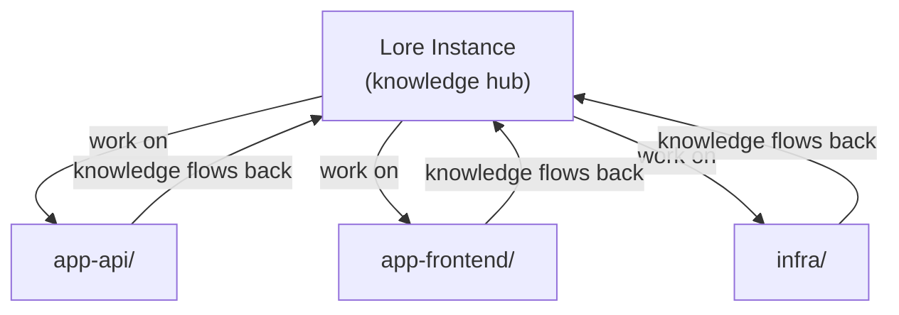

# Working Across Repos

Lore is designed as a hub — one Lore instance that tracks and performs work across all your other repositories.

## How It Works



1. **Connect your agent to the Lore instance.** CLI agents launch from here directly. IDE agents use [`/lore-link`](#ide-workflow-lore-link) to work from the code repo with hooks firing from the hub.

2. **Work on other repos.** The agent reads, writes, and runs commands across repos using absolute paths.

    ```
    "Fix the auth bug in ~/projects/app-api"
    "Run the tests in ~/projects/app-frontend"
    "Update the Terraform config in ~/projects/infra"
    ```

3. **Knowledge captures back to Lore.** Gotchas become skills, endpoints go to context docs, multi-step procedures become runbooks — all stored in the Lore instance, available next session.

## Boundaries

The agent operates on files and commands anywhere on your machine — reads, writes, git, tests, search all use absolute paths. No path restriction.

Knowledge always stays in Lore: skills, environment docs, runbooks, and work tracking write to the hub, never to work repos.

## Two Workflows

Choose based on your agent and tooling:

**CLI agents (Claude Code, OpenCode):** Launch from the Lore instance. This loads instructions, hooks, and accumulated knowledge. Then reference any other repo by path.

```bash
cd ~/projects/my-lore-project
claude       # Claude Code
opencode     # OpenCode
```

**IDE agents (Cursor):** Use [`/lore-link`](#ide-workflow-lore-link) to work from your code repo. You keep full file tree, git integration, and search — hooks still fire from the hub.

## IDE Workflow: /lore-link

### Usage

Tell your agent which repo to link:

- "Link my-app to this hub" — connects a work repo
- "Unlink my-app" — removes the link
- "Show linked repos" — lists all links with stale detection
- "Refresh linked repos" — regenerates configs with latest hooks

### What It Generates

In the target repo, `/lore-link` creates:

- **Claude Code** — `.claude/settings.json` with hooks pointing to the hub
- **Cursor** — `.cursor/hooks.json` + `.cursor/mcp.json` + `.cursor/rules/lore-*.mdc` pointing to the hub
- **OpenCode** — `.opencode/plugins/` wrappers (4 of 7 hub plugins: session-init, protect-memory, knowledge-tracker, harness-guard) + `.opencode/commands/` + `opencode.json` pointing to the hub
- **Instructions** — `CLAUDE.md` rewritten from hub's `.lore/instructions.md`
- **Link record** — `.lore/links` in the hub repo (a JSON array) updated with the linked repo path and timestamp

All generated files are added to the target repo's `.gitignore` automatically. Existing files are backed up with a `.bak` extension before overwriting.

### Knowledge Still Centralizes

Even when working from a linked repo, knowledge captures back to the hub. Skills, context docs, and runbooks all write to the hub directory — the work repo stays clean.

### After Harness Updates

After a harness update, tell your agent to refresh linked repos — it regenerates configs with the latest hooks.

## Team Topologies

For teams, a shared instance in git or per-developer instances both work — knowledge sharing happens through normal git workflows.

## See Also

- [Working with Lore](working-with-lore.md) — day-to-day interaction patterns
- [Platform Overview](../reference/platforms/index.md) — how hooks work per agent
- [Command Reference](../reference/commands.md) — full slash command list
