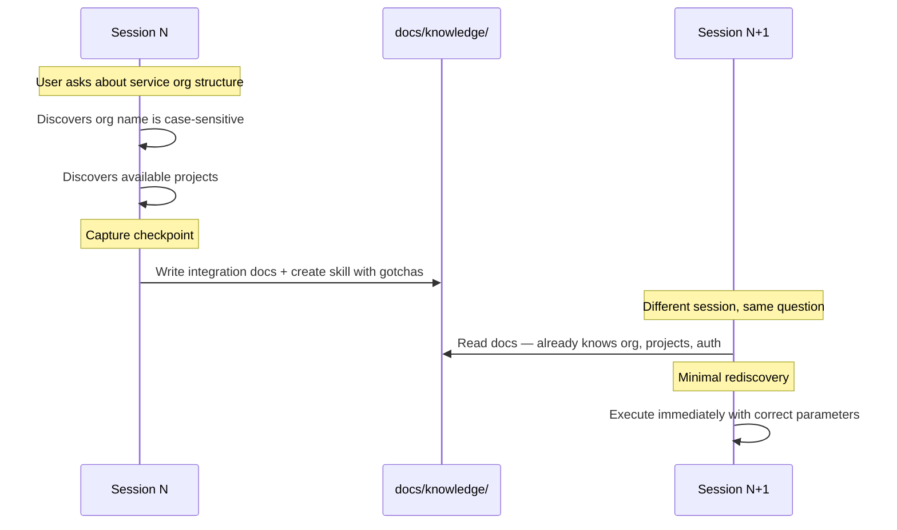
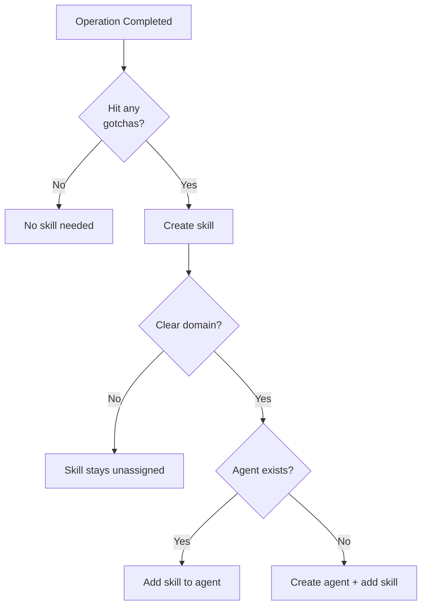
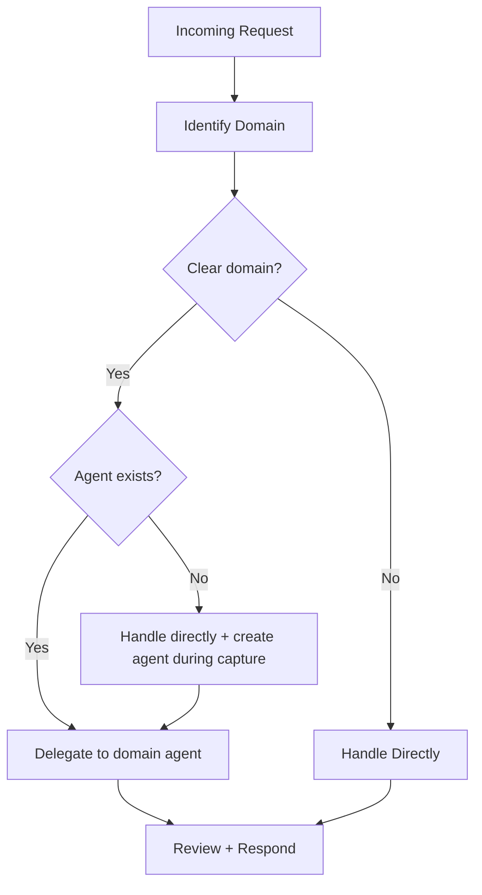
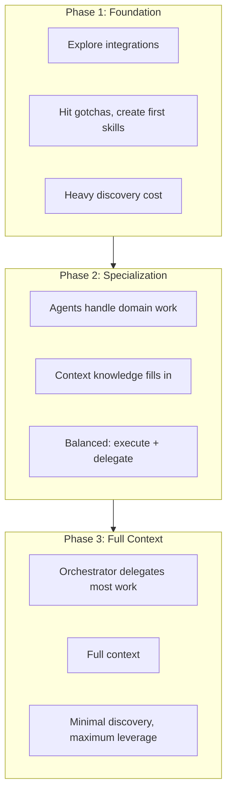

# How It Works

AI agents are ephemeral — every session starts from zero. Lore wraps your coding agent in a persistent, git-versioned knowledge base so it picks up where it left off.

## System Architecture


## Three Goals

### 1. Knowledge Capture

Every session produces knowledge as a byproduct — endpoints, gotchas, org structure, tool parameters. Post-tool-use reminders encourage the agent to extract this into persistent documentation. When an operation produces non-obvious knowledge, it becomes a skill. When a skill has a clear domain, it gets an agent.

#### The "Don't Ask Twice" Loop



#### What Gets Captured Where

| Knowledge Type | Destination | Example |
|---------------|-------------|---------|
| API endpoints, URLs, services | `docs/knowledge/environment/` | Service API base URL |
| Tool gotchas, auth quirks | `.lore/skills/` | Case-sensitive org name |
| Dependencies, relationships | `docs/knowledge/environment/` | Which services connect to what |
| Strategic initiatives | `docs/work/roadmaps/` | Cloud migration phases |
| Tactical work | `docs/work/plans/` | Phase 1 networking setup |
| Multi-step procedures | `docs/knowledge/runbooks/` | Deploy to staging |

#### Ownership

Skills and agents use a naming convention to separate framework-owned from operator-owned content:

- **`lore-*` prefix** — framework-owned. Overwritten on `/lore-update`. Examples: `lore-capture`, `lore-create-skill`, `lore-documentation-agent`.
- **No prefix** — operator-owned. Never touched by sync or generation scripts. Examples: `bash-macos-compat`, `github-agent`.

Discovered gotchas are operator-owned from birth — Lore creates the file, the operator owns it. The `lore-*` boundary is enforced by `sync-framework.sh` and `generate-agents.sh`, which only process `lore-*` items.

#### How Skills and Agents Emerge

**Rule: Every gotcha becomes a skill.** Auth quirks, encoding issues, parameter tricks — all skills. Skills must be generic (no context data). Skill creation can trigger agent creation: one agent per domain.



### 2. Delegation

The orchestrator routes work to domain agents based on a simple rule: **domain = delegation trigger**. For compound requests, reminders nudge the orchestrator to split independent branches across parallel subagents and keep dependency-gated steps sequential. Agents own their domain end-to-end and create skills as they need them.



| Orchestrator | Domain Agent |
|-------------|-------------|
| Understand user intent | Execute domain tasks |
| Choose which agent(s) | Load and use domain skills |
| Coordinate multi-agent flows | Create new skills when needed |
| Strategic decisions | Domain-specific details |

#### Subagent Context Contract

Every domain agent loads `docs/context/agent-rules.md` and relevant files in `docs/context/conventions/` before implementation.

#### Per-Platform Model Configuration

Agents carry per-platform model preferences in their frontmatter:

```yaml
---
name: github-agent
domain: GitHub
claude-model: sonnet
opencode-model: openai/gpt-4o
cursor-model: # not yet supported
---
```

Instance-level defaults live in `.lore-config` under `subagentDefaults`. Agent frontmatter overrides the defaults. See [Configuration](guides/configuration.md#subagentdefaults) for details.

### 3. Session Acceleration

Session acceleration is the compound effect of knowledge capture and delegation working together. As captured knowledge builds the base and delegation distributes the workload, each session benefits from every previous session's discoveries.



## Context Efficiency

Lore uses indirection — telling the agent *where to find things* rather than loading everything into context. Skills and docs load on-demand; only what's needed for orientation loads every session.

| Layer | What It Contains |
|-------|------------------|
| `.lore/instructions.md` (~80 lines) | Framework rules, knowledge routing, naming conventions |
| Session start: framework | Operating principles, active agents, active roadmaps/plans |
| Session start: project context | Operator customization from `docs/context/agent-rules.md` |
| Session start: operator profile | Identity and preferences from `docs/knowledge/local/operator-profile.md` (gitignored) |
| Session start: conventions | Coding and docs standards from `docs/context/conventions/` |
| Session start: knowledge map | Directory tree of docs/, skills/, and agents/ |
| Session start: local memory | Scratch notes from `MEMORY.local.md` (gitignored) |
| Per-prompt reinforcement | Delegation + knowledge discovery + work tracking nudges |
| Post-tool-use reinforcement | Capture reminders with escalating urgency |
| Skills and docs | Loaded on-demand when invoked or needed |

Docs and skills have zero baseline session cost — they load on-demand. Agents and active roadmaps appear in every session banner but grow slowly in count. See [Configuration: Tuning](guides/configuration.md#tuning-for-large-instances) for managing growth.

## Hook Architecture

Hooks fire at session start, prompt submit, pre-tool-use, post-tool-use, and post-tool-use-failure. Shared logic in `lib/` keeps behavior consistent across platforms. See [Hook Architecture](guides/hook-architecture.md) for the full lifecycle, module layout, and platform adapter reference.

## Limitations

- **AI compliance**: Reinforcement prompts encourage capture and delegation but cannot force it. The agent may skip reminders in long sessions.
- **Operator involvement**: Running `/lore-capture` after substantive work improves capture rates. The system works best as a collaboration.
- **Knowledge completeness**: Early sessions have gaps. Context accumulates with each session. Quality correlates with capture consistency.
