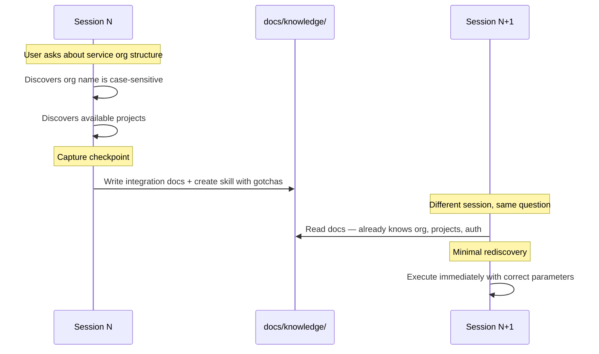
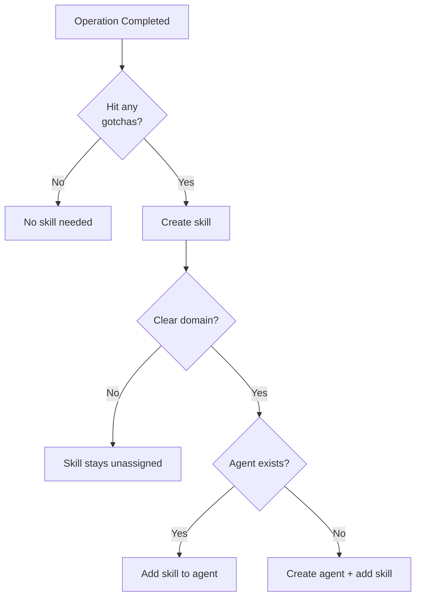
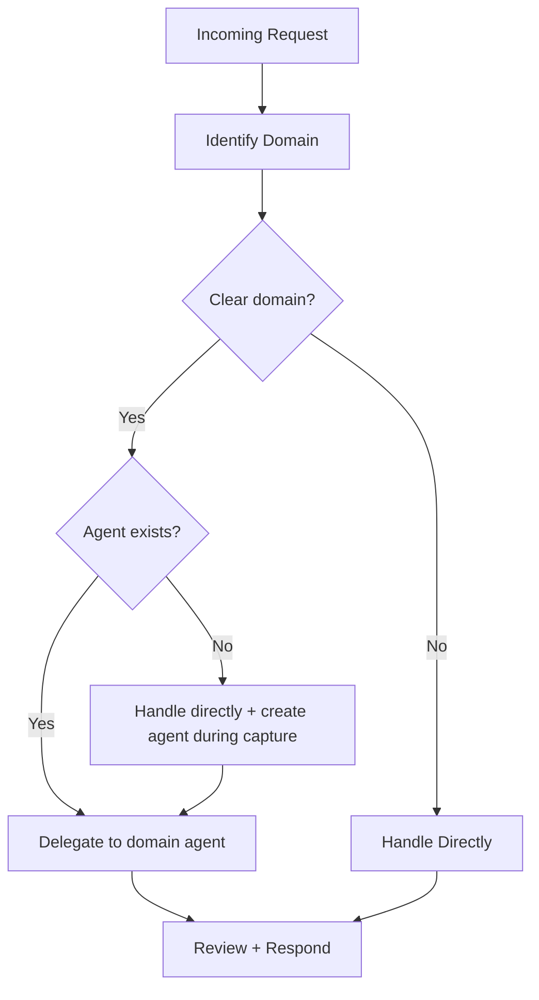
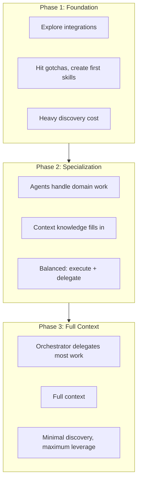
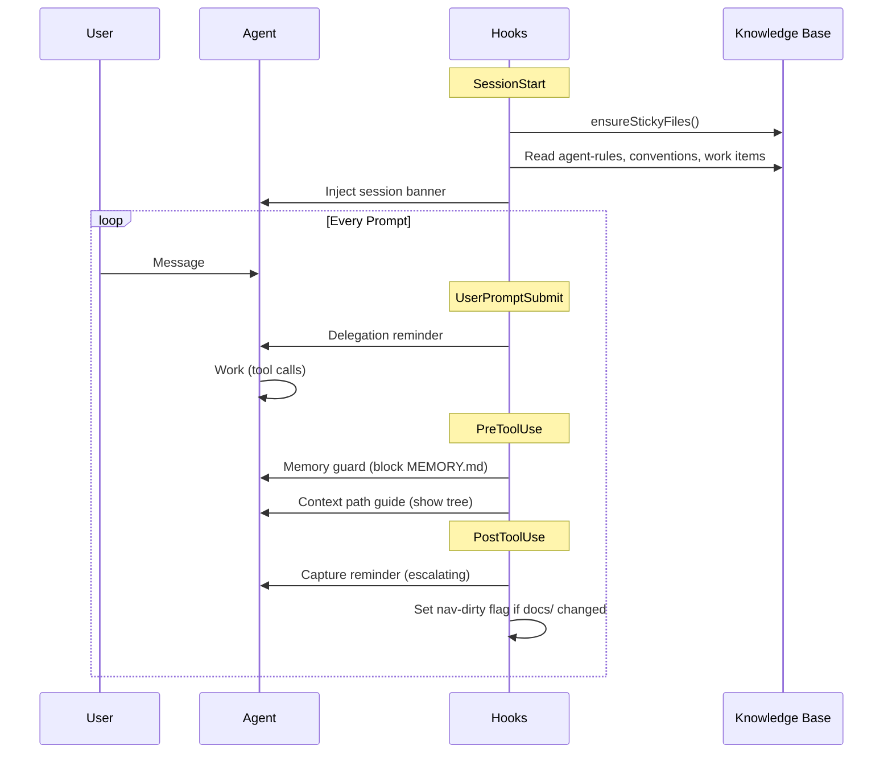
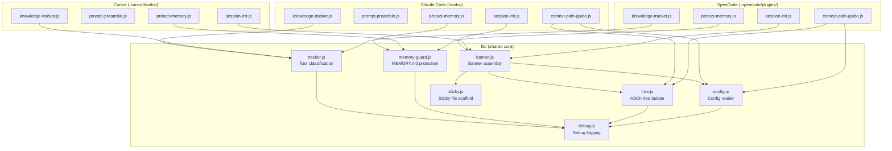

# How It Works

AI agents are ephemeral — every session starts from zero. Lore wraps your coding agent in a persistent, git-versioned knowledge base so it picks up where it left off.

## System Architecture

## Three Goals

### 1. Knowledge Capture

Every session produces knowledge as a byproduct — endpoints, gotchas, org structure, tool parameters. Post-tool-use reminders encourage the agent to extract this into persistent documentation. When an operation produces non-obvious knowledge, it becomes a skill. When a skill has a clear domain, it gets an agent.

#### The "Don't Ask Twice" Loop

#### What Gets Captured Where

| Knowledge Type | Destination | Example |
|---------------|-------------|---------|
| API endpoints, URLs, services | `docs/knowledge/environment/` | Service API base URL |
| Tool gotchas, auth quirks | `.lore/skills/` | Case-sensitive org name |
| Dependencies, relationships | `docs/knowledge/environment/` | Which services connect to what |
| Strategic initiatives | `docs/work/roadmaps/` | Cloud migration phases |
| Tactical work | `docs/work/plans/` | Phase 1 networking setup |
| Multi-step procedures | `docs/knowledge/runbooks/` | Deploy to staging |

#### How Skills and Agents Emerge

**Rule: Every gotcha becomes a skill.** Auth quirks, encoding issues, parameter tricks — all skills. Skills must be generic (no context data). Skill creation can trigger agent creation: one agent per domain.

### 2. Delegation

The orchestrator routes work to domain agents based on a simple rule: **domain = delegation trigger**. Agents own their domain end-to-end and create skills as they need them.

| Orchestrator | Domain Agent |
|-------------|-------------|
| Understand user intent | Execute domain tasks |
| Choose which agent(s) | Load and use domain skills |
| Coordinate multi-agent flows | Create new skills when needed |
| Strategic decisions | Domain-specific details |

### 3. Session Acceleration

Session acceleration is the compound effect of knowledge capture and delegation working together. As captured knowledge builds the base and delegation distributes the workload, each session benefits from every previous session's discoveries.

**Phase 1 (Foundation):** First sessions discover everything — org names, auth flows, tool parameters. Capture extracts each gotcha as a skill or doc.

**Phase 2 (Specialization):** Domain agents handle routine work. The orchestrator delegates more than it executes. Context knowledge fills in.

**Phase 3 (Full Context):** Most requests dispatch directly to agents. Strong context. Novel work is the primary remaining discovery cost.

## Context Efficiency

A persistent knowledge base needs to be *available* every session without being *loaded* every session. Lore resolves this with **indirection** — telling the agent *where to find things* rather than loading everything into context. At session start, the agent receives a structured banner: framework rules, your project context, and a knowledge map showing what exists. Skills and docs are loaded on-demand.

| Layer | What It Contains |
|-------|------------------|
| `.lore/instructions.md` (~80 lines) | Framework rules, knowledge routing, naming conventions |
| Session start: framework | Operating principles, active agents, active roadmaps/plans |
| Session start: project context | Operator customization from `docs/context/agent-rules.md` (project identity, agent behavior) |
| Session start: conventions | Coding and docs standards from `docs/context/conventions/` — injected every session |
| Session start: knowledge map | ASCII tree of docs/, skills/, and agents/ — current structure at a glance |
| Session start: local memory | Scratch notes from `MEMORY.local.md` (gitignored) — included when non-empty |
| Per-prompt reinforcement | Delegation reminder + task-list guidance (every prompt) |
| Post-tool-use reinforcement | Capture reminders with escalating urgency (after bash commands and file edits) |
| Skills and docs | Loaded on-demand when invoked or needed |

Things that grow fastest (docs, skills) have zero baseline cost. Things with nonzero cost (agents, active roadmaps) grow slowly.

## Hook Architecture

Lore hooks into the agent's lifecycle at four points. Shared logic lives in `lib/`, with thin adapters for each platform.

### Hook Lifecycle

### Module Layout

### Platform Adapters

Each platform has a different hook API. Adapters are thin — they translate between the platform's interface and the shared `lib/` functions.

| Hook Point | Claude Code | Cursor | OpenCode |
|-----------|-------------|--------|----------|
| Session start | `SessionStart` subprocess → stdout JSON | `sessionStart` subprocess → stdout | `session.created` event → `client.session.prompt()` |
| Per-prompt reminder | `UserPromptSubmit` → stdout | `beforeSubmitPrompt` → stdout | `experimental.chat.system.transform` → system prompt |
| Memory guard | `PreToolUse` → stdin JSON, stdout JSON | `beforeReadFile` → exit code | `tool.execute.before` → async handler |
| Knowledge tracker | `PostToolUse` → stdin JSON, stdout | `afterFileEdit` / `afterShellExecution` → stdout | `tool.execute.after` → async handler |
| Context path guide | `PreToolUse` → stdin JSON, stdout JSON | — | `tool.execute.before` → async handler |
| Compaction resilience | N/A (context preserved) | Condensed banner every prompt | `experimental.session.compacting` → re-inject |

## Limitations

- **AI compliance**: Reinforcement prompts encourage capture and delegation but cannot force it. The agent may skip reminders in long sessions.
- **Operator involvement**: Running `/lore-capture` after substantive work improves capture rates. The system works best as a collaboration.
- **Knowledge completeness**: Early sessions have gaps. Context accumulates with each session. Quality correlates with capture consistency.
