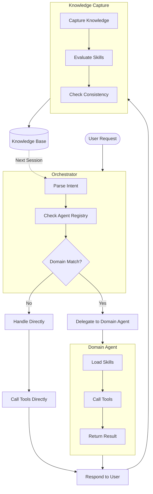
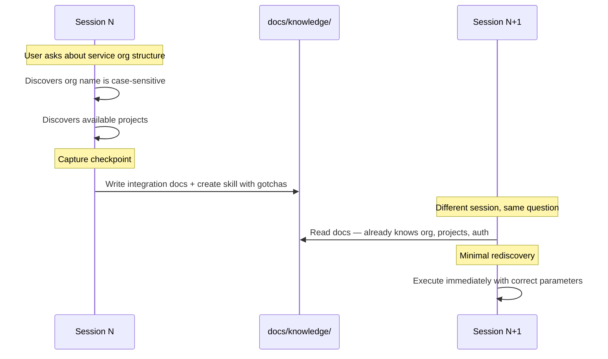
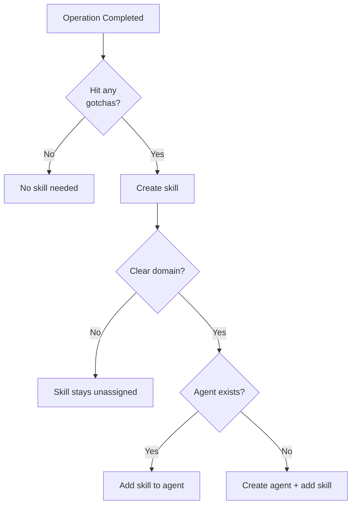
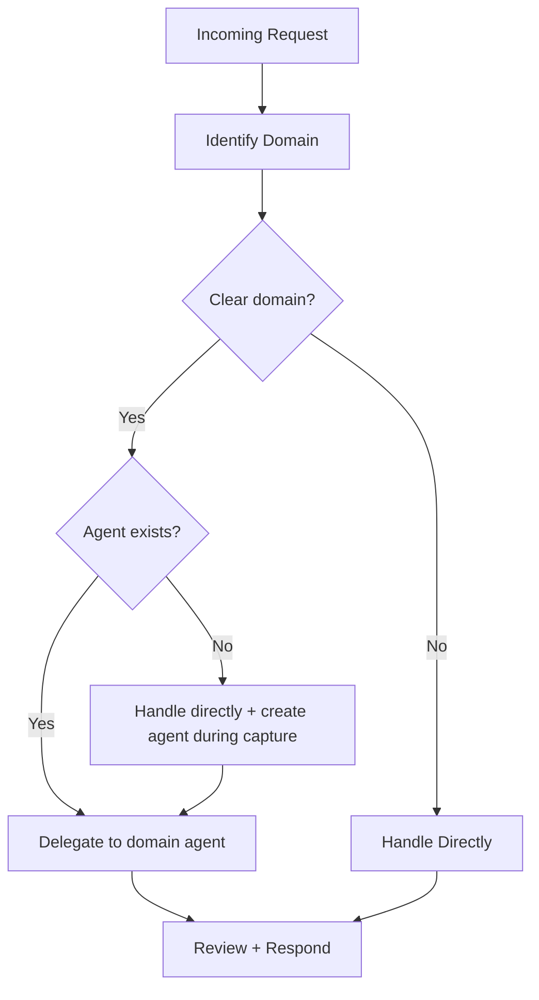
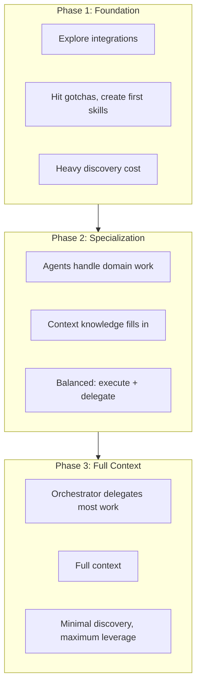
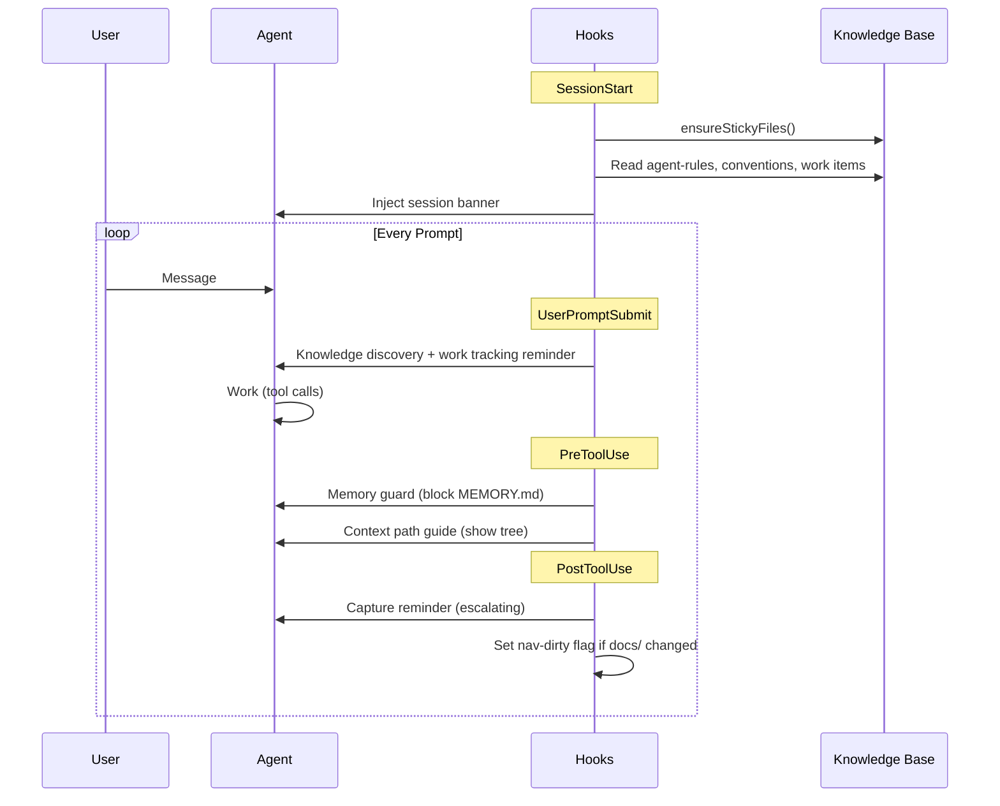

# How It Works

AI agents are ephemeral — every session starts from zero. Lore wraps your coding agent in a persistent, git-versioned knowledge base so it picks up where it left off.

## System Architecture



## Three Goals

### 1. Knowledge Capture

Every session produces knowledge as a byproduct — endpoints, gotchas, org structure, tool parameters. Post-tool-use reminders encourage the agent to extract this into persistent documentation. When an operation produces non-obvious knowledge, it becomes a skill. When a skill has a clear domain, it gets an agent.

#### The "Don't Ask Twice" Loop



#### What Gets Captured Where

| Knowledge Type | Destination | Example |
|---------------|-------------|---------|
| API endpoints, URLs, services | `docs/knowledge/environment/` | Service API base URL |
| Tool gotchas, auth quirks | `.lore/skills/` | Case-sensitive org name |
| Dependencies, relationships | `docs/knowledge/environment/` | Which services connect to what |
| Strategic initiatives | `docs/work/roadmaps/` | Cloud migration phases |
| Tactical work | `docs/work/plans/` | Phase 1 networking setup |
| Multi-step procedures | `docs/knowledge/runbooks/` | Deploy to staging |

#### Ownership

Skills and agents use a naming convention to separate framework-owned from operator-owned content:

- **`lore-*` prefix** — framework-owned. Overwritten on `/lore-update`. Examples: `lore-capture`, `lore-create-skill`, `lore-documentation-agent`.
- **No prefix** — operator-owned. Never touched by sync or generation scripts. Examples: `bash-macos-compat`, `github-agent`.

Discovered gotchas are operator-owned from birth — Lore creates the file, the operator owns it. The `lore-*` boundary is enforced by `sync-framework.sh` and `generate-agents.sh`, which only process `lore-*` items.

#### How Skills and Agents Emerge

**Rule: Every gotcha becomes a skill.** Auth quirks, encoding issues, parameter tricks — all skills. Skills must be generic (no context data). Skill creation can trigger agent creation: one agent per domain.



### 2. Delegation

The orchestrator routes work to domain agents based on a simple rule: **domain = delegation trigger**. For compound requests, reminders nudge the orchestrator to split independent branches across parallel subagents and keep dependency-gated steps sequential. Agents own their domain end-to-end and create skills as they need them.



| Orchestrator | Domain Agent |
|-------------|-------------|
| Understand user intent | Execute domain tasks |
| Choose which agent(s) | Load and use domain skills |
| Coordinate multi-agent flows | Create new skills when needed |
| Strategic decisions | Domain-specific details |

#### Subagent Context Contract

Subagents do not get full orchestrator context. They are intentionally scoped to avoid role confusion and token bloat.

Every domain agent is expected to load and apply:

- `docs/context/agent-rules.md`
- Relevant files in `docs/context/conventions/`

This gives subagents the project boundary and coding/doc conventions they need, while keeping orchestration responsibilities with the main agent. Subagents also follow the same self-learning loop: non-obvious gotchas become skills, new environment facts go to `docs/knowledge/environment/`, and reusable multi-step procedures go to `docs/knowledge/runbooks/`.

#### Per-Platform Model Configuration

Agents carry per-platform model preferences in their frontmatter, allowing different models across tools:

```yaml
---
name: github-agent
domain: GitHub
claude-model: sonnet
opencode-model: openai/gpt-4o
cursor-model: # not yet supported
---
```

Instance-level defaults live in `.lore-config` under `subagentDefaults`. Agent frontmatter overrides the defaults. See [Configuration](guides/configuration.md#subagentdefaults) for details.

At sync time, `sync-platform-skills.sh` resolves the cascade (agent frontmatter → instance defaults → omit) and writes a platform-native `model` field into each platform copy.

### 3. Session Acceleration

Session acceleration is the compound effect of knowledge capture and delegation working together. As captured knowledge builds the base and delegation distributes the workload, each session benefits from every previous session's discoveries.



**Phase 1 (Foundation):** First sessions discover everything — org names, auth flows, tool parameters. Capture extracts each gotcha as a skill or doc.

**Phase 2 (Specialization):** Domain agents handle routine work. The orchestrator delegates more than it executes. Context knowledge fills in.

**Phase 3 (Full Context):** Most requests dispatch directly to agents. Strong context. Novel work is the primary remaining discovery cost.

## Context Efficiency

A persistent knowledge base needs to be *available* every session without being *loaded* every session. Lore resolves this with **indirection** — telling the agent *where to find things* rather than loading everything into context. At session start, the agent receives a structured banner: framework rules, your project context, and a knowledge map showing what exists. Skills and docs are loaded on-demand.

| Layer | What It Contains |
|-------|------------------|
| `.lore/instructions.md` (~80 lines) | Framework rules, knowledge routing, naming conventions |
| Session start: framework | Operating principles, active agents, active roadmaps/plans |
| Session start: project context | Operator customization from `docs/context/agent-rules.md` (project identity, agent behavior) |
| Session start: conventions | Coding and docs standards from `docs/context/conventions/` — injected every session |
| Session start: knowledge map | Directory tree of docs/, skills/, and agents/ — structure at a glance |
| Session start: local memory | Scratch notes from `MEMORY.local.md` (gitignored) — included when non-empty |
| Per-prompt reinforcement | Delegation + knowledge discovery + work tracking nudges (every prompt) |
| Post-tool-use reinforcement | Capture reminders with escalating urgency (after bash commands and file edits) |
| Skills and docs | Loaded on-demand when invoked or needed |

Things that grow fastest (docs, skills) have zero baseline cost. Things with nonzero cost (agents, active roadmaps) grow slowly.

### What Grows and What Doesn't

Not all knowledge has the same context cost. Understanding the growth profile helps you manage a large instance:

| Category | Loaded When | Growth Rate | Context Cost |
|----------|-------------|-------------|--------------|
| Instructions (`.lore/instructions.md`) | Every session | Rarely changes | Fixed (~80 lines) |
| Agent rules (`docs/context/agent-rules.md`) | Every session | Rarely changes | Fixed (operator-controlled) |
| Conventions (`docs/context/conventions/`) | Every session | Rarely changes | Fixed (operator-controlled) |
| Knowledge map (directory tree) | Every session | Grows with dirs | Bounded by `treeDepth` |
| Active agents | Every session | ~1 per domain | Low (~1 line each in banner) |
| Active roadmaps/plans | Every session | Operator-created | Low (title + summary only) |
| Skills (`.lore/skills/`) | On-demand | Grows with gotchas | Zero baseline |
| Knowledge docs (`docs/knowledge/`) | On-demand | Grows fastest | Zero baseline |
| Archived work items | On-demand | Accumulates | Zero baseline (dirs visible in tree) |

### Tuning for Large Instances

As a knowledge base grows, the session banner's main variable cost is the **knowledge map** — a directory-only tree of `docs/`, `skills/`, and `agents/`. The tree shows structure, not content: only directory names appear, never individual files. This keeps the map compact — growth is proportional to the number of directories, not the number of documents. The agent reads specific directories on-demand when it needs to find files.

**`treeDepth`** — set in `.lore-config` to limit how many directory levels the knowledge map displays. Default is 5. Reducing to 3 or 4 hides deep nesting while still showing top-level structure.

```json
{
  "treeDepth": 3
}
```

**When to act:**

- Knowledge map exceeds ~50 lines → reduce `treeDepth` or reorganize subdirectories
- `MEMORY.local.md` exceeds ~50 lines → route content to skills or `docs/knowledge/`
- Conventions section growing → keep it focused on rules, move reference material to `docs/knowledge/`
- Many active work items → archive completed items with `/lore-capture`

## Hook Architecture

Lore hooks into the agent's lifecycle at four points. Shared logic lives in `lib/`, with thin adapters for each platform.

### Hook Lifecycle



### Module Layout

```mermaid
flowchart TB
    subgraph lib["lib/ (shared core)"]
        banner["banner.js<br/>Banner assembly"]
        tree["tree.js<br/>ASCII tree builder"]
        config["config.js<br/>Config reader"]
        sticky["sticky.js<br/>Sticky file scaffold"]
        tracker["tracker.js<br/>Tool classification"]
        guard["memory-guard.js<br/>MEMORY.md protection"]
        debug["debug.js<br/>Debug logging"]
        hooklog["hook-logger.js<br/>Event logging"]
    end

    subgraph claude["Claude Code (hooks/)"]
        cc_si[session-init.js]
        cc_pp[prompt-preamble.js]
        cc_pm[protect-memory.js]
        cc_kt[knowledge-tracker.js]
        cc_cp[context-path-guide.js]
    end

    subgraph cursor["Cursor (.cursor/hooks/ + .cursor/mcp/)"]
        cu_si[session-init.js]
        cu_cn[capture-nudge.js]
        cu_cf[compaction-flag.js]
        cu_ft[failure-tracker.js]
        cu_pm[protect-memory.js]
        cu_kt[knowledge-tracker.js]
        cu_mcp[lore-server.js — MCP]
    end

    subgraph opencode["OpenCode (.opencode/plugins/)"]
        oc_si[session-init.js]
        oc_pm[protect-memory.js]
        oc_kt[knowledge-tracker.js]
        oc_cp[context-path-guide.js]
    end

    cc_si & cu_si & oc_si --> banner
    banner --> tree & config & sticky
    cc_kt & cu_kt & oc_kt --> tracker
    cu_cn --> tracker & banner
    cu_mcp --> banner & tracker & config
    cc_pm & cu_pm & oc_pm --> guard
    cc_cp & oc_cp --> tree & config
    tracker & guard & tree & config --> debug
    cc_si & cu_si & oc_si & cc_kt & cu_kt & oc_kt & cu_cn --> hooklog
```



### Platform Adapters

Each platform has a different hook API. Adapters are thin — they translate between the platform's interface and the shared `lib/` functions.

| Hook Point | Claude Code | Cursor | OpenCode |
|-----------|-------------|--------|----------|
| Session start | `SessionStart` → stdout | `sessionStart` → stdout JSON | `SessionInit` → `client.app.log()` |
| Per-prompt | `UserPromptSubmit` → stdout | — (no per-prompt hook) | `chat.system.transform` → system prompt |
| Memory guard | `PreToolUse` → stdin/stdout JSON | `beforeReadFile` + `preToolUse` → JSON | `tool.execute.before` → throw to block |
| Knowledge tracker | `PostToolUse` → stdout JSON | `afterFileEdit` → state file (silent) | `tool.execute.after` → `client.app.log()` |
| Capture nudge | `PostToolUse` (in knowledge-tracker) | `beforeShellExecution` → `agent_message` | `tool.execute.after` (in knowledge-tracker) |
| Context path guide | `PreToolUse` → stdout JSON | — | `tool.execute.before` → `client.app.log()` |
| MCP tools | — | `lore_check_in` + `lore_context` | — |
| Compaction | `SessionStart` re-fires | `preCompact` flag → next shell cmd | `session.compacting` → re-inject banner |

Cursor's hook surface is limited — `afterFileEdit` and `postToolUseFailure` produce no visible output, and there is no per-prompt hook. The MCP server (`lore_check_in`, `lore_context`) compensates by providing on-demand access to nudges and the full knowledge map via tool calls.

### Hook Observability

All hooks are instrumented with structured event logging via `lib/hook-logger.js`. When `LORE_HOOK_LOG=1` is set, each hook fire appends a JSON line to `.git/lore-hook-events.jsonl`:

```json
{"ts": 1740000000000, "platform": "cursor", "hook": "capture-nudge", "event": "beforeShellExecution", "output_size": 52, "state": {"bash": 3}}
```

Fields:

| Field | Description |
|-------|-------------|
| `ts` | Unix epoch milliseconds |
| `platform` | `claude`, `cursor`, or `opencode` |
| `hook` | Hook filename (e.g., `capture-nudge`, `session-init`) |
| `event` | Platform event name (e.g., `beforeShellExecution`, `PostToolUse`) |
| `output_size` | Characters injected into the agent's context (0 for silent hooks) |
| `state` | Optional hook-specific snapshot (bash counter, flags) |

Run `bash scripts/analyze-hook-logs.sh` to produce a summary covering fire rates, output sizes, accumulated context tokens, and missing hooks. See [Configuration](guides/configuration.md#hook-event-logging) for setup details.

## Limitations

- **AI compliance**: Reinforcement prompts encourage capture and delegation but cannot force it. The agent may skip reminders in long sessions.
- **Operator involvement**: Running `/lore-capture` after substantive work improves capture rates. The system works best as a collaboration.
- **Knowledge completeness**: Early sessions have gaps. Context accumulates with each session. Quality correlates with capture consistency.
