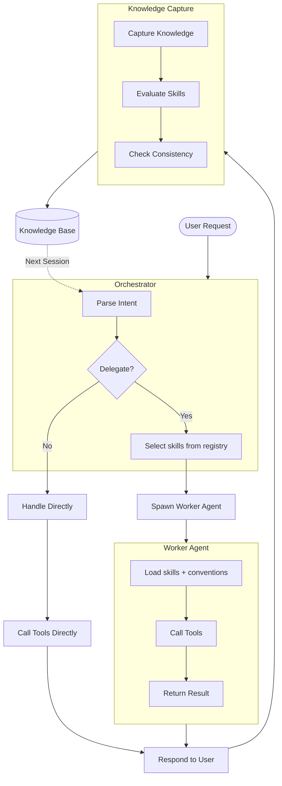
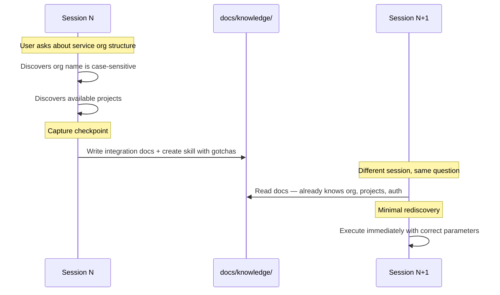
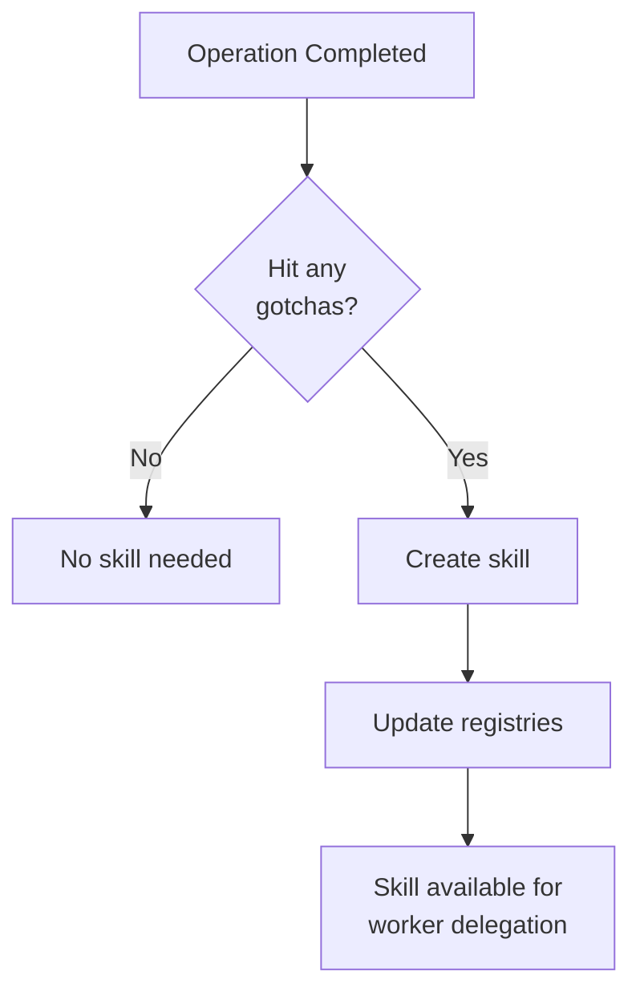
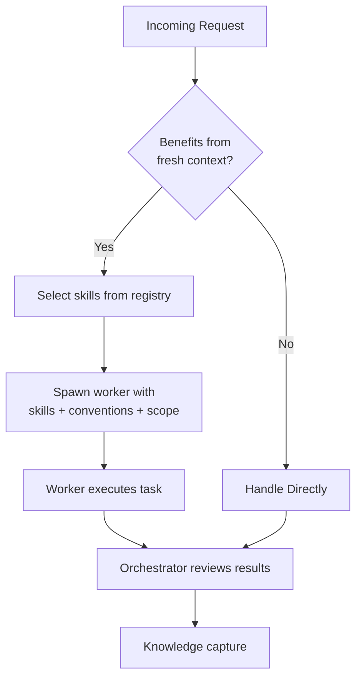
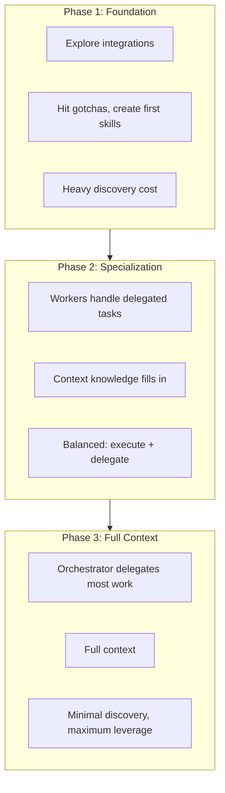

# How It Works

AI agents are ephemeral — every session starts from zero. Lore wraps your coding agent in a persistent, git-versioned knowledge base so it picks up where it left off.

## System Architecture

## Three Goals

### 1. Knowledge Capture

Every session produces knowledge as a byproduct — endpoints, gotchas, org structure, tool parameters. Post-tool-use reminders encourage the agent to extract this into persistent documentation. When an operation produces non-obvious knowledge, it becomes a skill. The orchestrator finds relevant skills by name and description when delegating related tasks.

#### The "Don't Ask Twice" Loop

#### What Gets Captured Where

| Knowledge Type | Destination | Example |
|---------------|-------------|---------|
| API endpoints, URLs, services | `docs/knowledge/environment/` | Service API base URL |
| Tool gotchas, auth quirks | `.lore/skills/` | Case-sensitive org name |
| Dependencies, relationships | `docs/knowledge/environment/` | Which services connect to what |
| Strategic initiatives | `docs/work/roadmaps/` | Cloud migration phases |
| Tactical work | `docs/work/plans/` | Phase 1 networking setup |
| Multi-step procedures | `docs/knowledge/runbooks/` | Deploy to staging |

#### Ownership

See [Platform Support: Sync Boundaries](guides/platform-support.md#sync-boundaries) for the `lore-*` prefix convention and what sync overwrites.

#### How Skills and Agents Emerge

### 2. Delegation

The orchestrator delegates work to worker agents — ephemeral context windows loaded with curated skills and conventions per-task. For compound requests, the orchestrator spawns multiple workers in parallel for independent branches and keeps dependency-gated steps sequential.

| Orchestrator | Worker Agent |
|-------------|-------------|
| Understand user intent | Execute delegated task |
| Select relevant skills | Load what orchestrator specifies |
| Coordinate multi-worker flows | Stay within scope boundaries |
| Handle knowledge capture | Report gotchas and findings |

#### Subagent Context Contract

Workers receive what the orchestrator specifies: task description, skill file paths, convention file paths, and scope boundaries. `docs/context/agent-rules.md` is injected into the orchestrator's session banner; workers receive conventions and skills selected by the orchestrator per-task.

#### Per-Platform Model Configuration

Per-platform model fields in agent frontmatter (`claude-model`, `opencode-model`, `cursor-model`) override `subagentDefaults`. See [Configuration](guides/configuration.md#subagentdefaults).

### 3. Session Acceleration

## Context Efficiency

Lore uses indirection — telling the agent *where to find things* rather than loading everything into context.

| Layer | What It Contains |
|-------|------------------|
| `.lore/instructions.md` (~115 lines) | Framework rules, knowledge routing, naming conventions |
| Session start: framework | Operating principles, active agents, active roadmaps/plans |
| Session start: project context | Operator customization from `docs/context/agent-rules.md` |
| Session start: operator profile | Identity and preferences from `docs/knowledge/local/operator-profile.md` (gitignored) |
| Session start: conventions | Coding and docs standards from `docs/context/conventions/` |
| Session start: knowledge map | Directory tree of docs/, skills/, and agents/ |
| Session start: local memory | Scratch notes from `MEMORY.local.md` (gitignored) |
| Per-prompt reinforcement | Delegation + knowledge discovery + work tracking nudges |
| Post-tool-use reinforcement | Capture reminders with escalating urgency |
| Skills and docs | Loaded on-demand when invoked or needed |

Docs and skills have zero baseline session cost — they load on-demand. Agents and active roadmaps appear in every session banner but grow slowly in count. See [Configuration: Tuning](guides/configuration.md#tuning-for-large-instances) for managing growth.

## Hook Architecture

Hooks fire at session start, prompt submit, pre-tool-use, post-tool-use, and post-tool-use-failure. Shared logic in `lib/` keeps behavior consistent across platforms. See [Hook Architecture](guides/hook-architecture.md) for the full lifecycle, module layout, and platform adapter reference.

For limitations and known gaps, see [Production Readiness](production-readiness.md#known-limitations).
