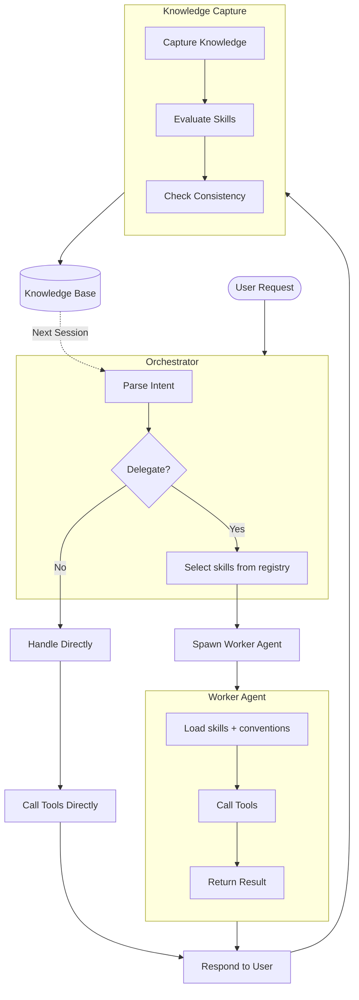
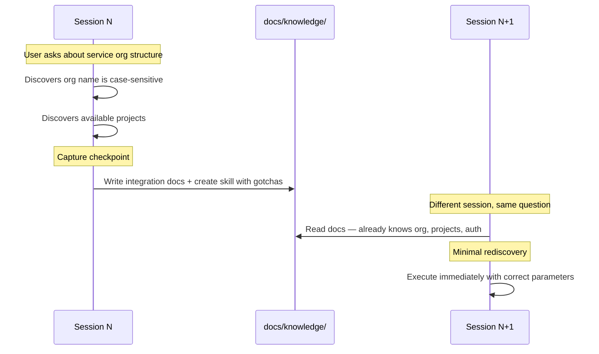
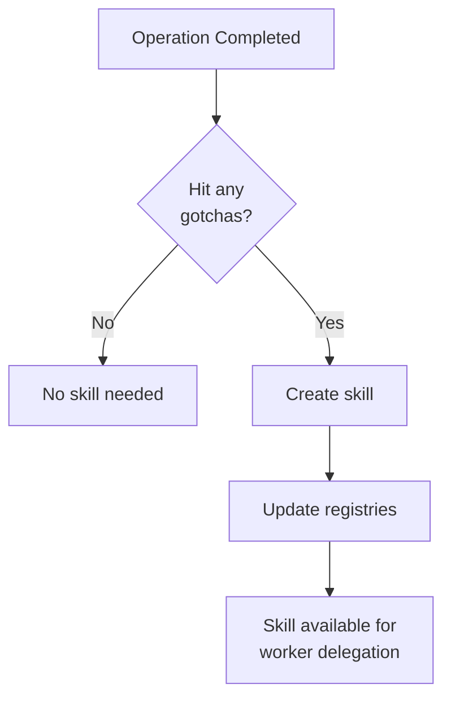

# How It Works

AI agents are ephemeral — every session starts from zero. Lore wraps your coding agent in a persistent, git-versioned knowledge base so it picks up where it left off.

## Harness Engineering

Prompt engineering is about crafting individual prompts. Context engineering is about curating what goes into the context window. Lore does both, but they're means to an end — the actual product is the **harness**: the hooks, delegation patterns, worker tiers, capture lifecycle, semantic search, derived file generation, skill system, and the rules that govern how all of it interacts.

The context is shaped by the harness — banner injection, convention loading, skill lazy-loading. The prompts are shaped by the harness — worker prompt structure, bail-out rules, return contracts. But the thing you're building and maintaining is the harness itself: the scaffolding that makes an AI agent operationally reliable across sessions, repos, and contributors.

This distinction matters because it changes what you optimize for. Prompt engineering optimizes for a single interaction. Context engineering optimizes for a single session. Harness engineering optimizes for **all sessions** — the system that makes every future session better than the last.

## System Architecture

```mermaid
flowchart TB
    User([User Request]) --> Orchestrator

    subgraph Orchestrator["Orchestrator"]
        direction TB
        Parse[Parse Intent] --> Decide{Delegate?}
        Decide -->|Yes| Select[Select skills from registry]
    end

    Decide -->|No| Direct[Handle Directly]
    Select --> Spawn[Spawn Worker Agent]

    subgraph Worker["Worker Agent"]
        direction TB
        Load[Load skills + conventions] --> Tools[Call Tools]
        Tools --> Result[Return Result]
    end

    Spawn --> Worker
    Direct --> Tools2[Call Tools Directly]
    Worker --> Respond[Respond to User]
    Tools2 --> Respond

    Respond --> Capture

    subgraph Capture["Knowledge Capture"]
        direction TB
        H1[Capture Knowledge] --> H2[Evaluate Skills]
        H2 --> H3[Check Consistency]
    end

    Capture --> KB[(Knowledge Base)]
    KB -.->|Next Session| Parse
```

## Three Goals

### 1. Knowledge Capture

Every session produces knowledge as a byproduct — endpoints, gotchas, org structure, tool parameters. Post-tool-use reminders encourage the agent to extract that knowledge into persistent documentation. When an operation produces non-obvious knowledge, it becomes a skill. The orchestrator finds relevant skills by name and description when delegating related tasks.

#### The Capture-and-Reuse Loop

```mermaid
sequenceDiagram
    participant S1 as Session N
    participant Docs as docs/knowledge/
    participant S2 as Session N+1

    Note over S1: User asks about service org structure
    S1->>S1: Discovers org name is case-sensitive
    S1->>S1: Discovers available projects

    Note over S1: Capture checkpoint
    S1->>Docs: Write integration docs + create skill with gotchas

    Note over S2: Different session, same question
    S2->>Docs: Read docs — already knows org, projects, auth
    Note over S2: Minimal rediscovery
    S2->>S2: Execute immediately with correct parameters
```

#### What Gets Captured Where

| Knowledge Type | Destination | Example |
|---------------|-------------|---------|
| API endpoints, URLs, services | `docs/knowledge/environment/` | Service API base URL |
| Tool gotchas, auth quirks | `.lore/skills/` | Case-sensitive org name |
| Dependencies, relationships | `docs/knowledge/environment/` | Which services connect to what |
| Strategic initiatives | `docs/work/roadmaps/` | Cloud migration phases |
| Tactical work | `docs/work/plans/` | Phase 1 networking setup |
| Quick observations, bugs | `docs/work/notes/` | Flaky auth timeout under load |
| Multi-step procedures | `docs/knowledge/runbooks/` | Deploy to staging |

#### Ownership

See [Platform Support: Sync Boundaries](guides/platform-support.md#sync-boundaries) for the `lore-*` prefix convention and what sync overwrites.

#### How Skills and Agents Emerge

```mermaid
flowchart TD
    op[Operation Completed] --> gotcha{Hit any\ngotchas?}
    gotcha -->|No| skip[No skill needed]
    gotcha -->|Yes| createSkill[Create skill]
    createSkill --> registry[Update registries]
    registry --> done[Skill available for\nworker delegation]
```

See [How Delegation Works](how-delegation-works.md) for the orchestrator-worker model, worker tiers, and session acceleration.

## Context Efficiency

Lore uses indirection — telling the agent *where to find things* rather than loading all knowledge into context at session start.

| Layer | What It Contains |
|-------|------------------|
| `.lore/instructions.md` | Framework rules, knowledge routing, naming conventions |
| Session start: framework | Operating principles, active agents, active roadmaps/plans |
| Session start: project context | Operator customization from `docs/context/agent-rules.md` |
| Session start: operator profile | Identity and preferences from `docs/knowledge/local/operator-profile.md` (gitignored) |
| Session start: conventions | Coding and docs standards from `docs/context/conventions/` |
| Session start: knowledge map | Directory tree of `docs/`, `.lore/skills/`, and `.lore/agents/` |
| Session start: local memory | Scratch notes from `MEMORY.local.md` (gitignored) |
| Per-prompt reinforcement | Delegation + knowledge discovery + work tracking nudges |
| Post-tool-use reinforcement | Capture reminders with escalating urgency |
| Skills and docs | Loaded on-demand when invoked or needed |

**Static vs. dynamic banner split:** Conventions, agent-rules, and project context are baked into `CLAUDE.md` at generation time — these are stable and benefit from prompt cache hits. Active work items, the knowledge map, and the skill registry are injected by the `SessionStart` hook each session, so they stay current without regenerating `CLAUDE.md`.

When the Docker sidecar is running, the session banner includes a semantic search URL. Agents query by topic to find relevant docs and skills without loading the full directory tree. See [Docs UI & Semantic Search](guides/docs-ui.md).

Docs and skills have zero baseline session cost — they load on-demand. Agents and active roadmaps appear in every session banner but grow slowly in count. See [Configuration: Tuning](guides/configuration.md#tuning-for-large-instances) for managing growth.

## Hook Architecture

Hooks fire at session start, prompt submit, pre-tool-use, post-tool-use, and post-tool-use-failure. Shared logic in `lib/` keeps behavior consistent across platforms. See [Hook Architecture](guides/hook-architecture.md) for the full lifecycle, module layout, and platform adapter reference.

For limitations and known gaps, see [Production Readiness](production-readiness.md#known-limitations).
