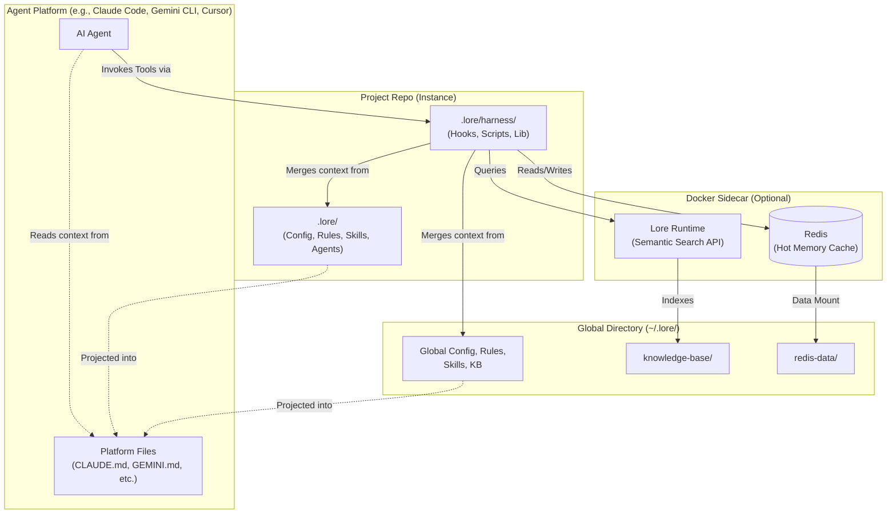

# Architecture

Lore is a harness for agentic coding tools. It centrally manages the three standard components of an agentic framework — **rules**, **skills**, and **agents** — plus a persistent knowledge base, and projects them into every platform's native format.

## The Global Directory (~/.lore/)

The global directory (`~/.lore/`) is a Git repository in your home folder. It stores machine-global knowledge that applies across all your projects:

- **Rules** — policies, guardrails, and constraints that govern behavior (e.g., credential protection)
- **Skills** — modular instructions that equip agents with capabilities (e.g., coding principles, deployment procedures)
- **Agents** — autonomous personas configured for specific types of work (e.g., software engineer, technical writer)

The [Knowledge Base](../reference/knowledge-base.md) stores **fieldnotes** (captured snags) and **runbooks** (multi-step procedures) — persistent knowledge that agents discover via the banner and semantic search. See [What Lore Manages](../reference/managed-content.md) for details. See [Global and Project Directories](global-directory.md) for how global and project-local content merge.

## Project Instances

Individual repositories carry only project-specific context. When a session starts, the harness merges global knowledge with local project docs at runtime. Projects never contain your private identity or cross-project fieldnotes.

Project-scoped content lives in `docs/` (context, work items) and `.lore/` (project-level overrides). See [Global and Project Directories](global-directory.md) for the full merge model.

## The Projection Pipeline

Each platform (Claude Code, Gemini CLI, Cursor, Windsurf, Roo Code, OpenCode) has its own configuration format. The harness projects rules, skills, and agents into platform-native files automatically:

| Platform | Target files |
|----------|-------------|
| Claude Code | `CLAUDE.md`, `.claude/skills/`, `.claude/agents/` |
| Gemini CLI | `GEMINI.md` |
| Cursor | `.cursor/rules/*.mdc` |
| Windsurf | `.windsurfrules` |
| Roo Code | `.clinerules` |
| OpenCode | `opencode.json`, `.opencode/plugins/` |

One knowledge base, every platform. Write a fieldnote once — it's available everywhere. See [Platform Projections](projections.md) for how the projector works.

## The Sidecar

The optional Docker sidecar runs two services in a single Docker Compose setup:

- **Redis (Primary Working Memory)** — agents freely read and write session context. Facts carry heat scores that decay exponentially; high-heat items are candidates for graduation to the persistent KB via `/lore-memprint`. Redis data persists in the global directory (`~/.lore/redis-data/`) via a volume mount, surviving container restarts.
- **Semantic Search** — vector-based search over the full knowledge base, exposed as an MCP tool (`lore_search`). The search index is rebuilt on startup from KB files — no persistence needed.

Without Docker, agents fall back to `memory.local.md` for session notes and Glob/Grep for search. The sidecar enables the full memory tiering model but is not required.

## The Hook Architecture

Hooks are plain JavaScript files that fire at specific points in the agent lifecycle:

- **Session init** — loads the context banner (rules, skills, fieldnotes, runbooks)
- **Prompt preamble** — injects search-first and capture reminders before each message
- **Knowledge tracker** — monitors tool use and nudges capture at thresholds
- **Write guards** — enforces rules (security, coding, docs) before file writes
- **Harness guard** — protects harness files from unintended modification

All hooks are transparent, readable, and make no network requests. See [Hooks](hooks.md) for the full reference.
