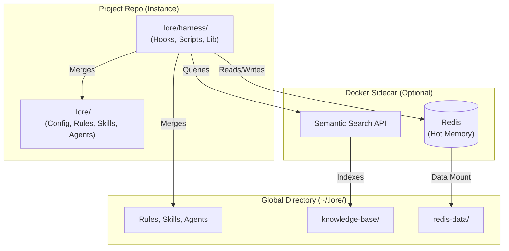

# Architecture

Lore is a harness for agentic coding tools. It centrally manages the three standard components of an agentic framework — **rules**, **skills**, and **agents** — plus a persistent knowledge base, and projects them into every platform's native format.

## The Global Directory (~/.lore/)

The global directory (`~/.lore/`) is a Git repository in your home folder. It stores machine-global knowledge that applies across all your projects:

- **Rules** — policies, guardrails, and constraints that govern behavior (e.g., credential protection)
- **Skills** — modular instructions that equip agents with capabilities (e.g., coding principles, deployment procedures)
- **Agents** — autonomous personas configured for specific types of work (e.g., software engineer, technical writer)

The [Knowledge Base](../reference/knowledge-base.md) stores **fieldnotes** (captured snags) and **runbooks** (multi-step procedures) — persistent knowledge that agents discover via the banner and semantic search. See [Agentic System](agentic-system.md) for details. See [Global and Project Directories](global-directory.md) for how global and project-local content merge.

## Project Instances

Individual repositories carry only project-specific context. When a session starts, the harness merges global knowledge with local project docs at runtime. Projects never contain your private identity or cross-project fieldnotes.

Project-scoped content lives in `.lore/` (config, rules, skills, agents, project-level overrides). See [Global and Project Directories](global-directory.md) for the full merge model.

## The Projection Pipeline

Each platform (Claude Code, Gemini CLI, Cursor, Windsurf, Roo Code, OpenCode) has its own configuration format. The harness projects rules, skills, and agents into platform-native files automatically:

| Platform | Target files |
|----------|-------------|
| Claude Code | `CLAUDE.md`, `.claude/settings.json`, `.claude/skills/`, `.claude/agents/` |
| Gemini CLI | `GEMINI.md`, `.gemini/settings.json` |
| Cursor | `.cursor/rules/*.mdc` |
| Windsurf | `.windsurfrules` |
| Roo Code | `.clinerules` |
| OpenCode | `opencode.json`, `.opencode/plugins/` |

**Platform toggling.** Set `"platforms"` in `.lore/config.json` to an array of active platform names (e.g. `["claude", "cursor"]`). The projector only generates files for active platforms and cleans up files for disabled ones — including removing empty parent directories. Omitting the field or setting it to an empty array activates all platforms, preserving backwards compatibility.

One knowledge base, every platform. Write a fieldnote once — it's available everywhere. See [Agentic System](agentic-system.md) for how the projector works.

## The Sidecar

The optional Docker sidecar runs two services in a single Docker Compose setup:

- **Redis (Primary Working Memory)** — agents freely read and write session context. Facts carry heat scores that decay exponentially; high-heat items are candidates for graduation to the persistent KB via `/lore memory burn`. Redis data persists in the global directory (`~/.lore/redis-data/`) via a volume mount, surviving container restarts.
- **Semantic Search** — vector-based search over the full knowledge base, exposed as an MCP tool (`lore_search`). The search index is rebuilt on startup from KB files — no persistence needed.

Without Docker, agents fall back to `memory.local.md` for session notes and Glob/Grep for search. The sidecar enables the full memory tiering model but is not required.

## The Hook Architecture

Hooks are plain JavaScript files that fire at specific points in the agent lifecycle:

- **Session init** — creates sticky files and emits the dynamic banner (operator profile, session memory)
- **Prompt preamble** — injects search-first and capture reminders before each message
- **Memory nudge** — monitors tool use and nudges capture at thresholds
- **Harness guard** — blocks agent writes to the global directory (`~/.lore/`)
- **Protect memory** — redirects `MEMORY.md` access to the gitignored session scratchpad
- **Search guard** — nudges agents toward semantic search on indexed paths

All hooks are transparent and readable. The session-init hook probes the sidecar's health endpoint at startup to display connection status. No hooks make external network calls. See [Hooks](hooks.md) for the full reference.
