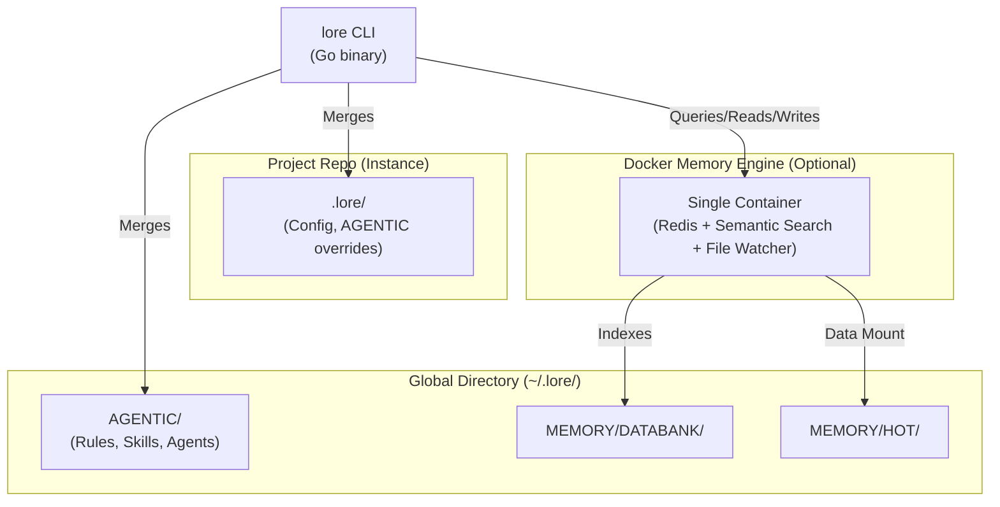

# Architecture

Lore is a harness for agentic coding tools. It centrally manages the three standard components of an agentic framework — **rules**, **skills**, and **agents** — plus a persistent databank, and projects them into every platform's native format.

## The Global Directory (~/.lore/)

The global directory (`~/.lore/`) is a directory in your home folder. It stores machine-global knowledge that applies across all your projects:

- **Rules** — policies, guardrails, and constraints that govern behavior (e.g., credential protection)
- **Skills** — modular instructions that equip agents with capabilities (e.g., coding principles, deployment procedures)
- **Agents** — autonomous personas configured for specific types of work (e.g., software engineer, technical writer)

The [Databank](../reference/databank.md) stores **fieldnotes** (captured snags) and **runbooks** (multi-step procedures) — persistent knowledge that agents discover via the banner and semantic search. See [Agentic System](agentic-system.md) for details. See [Global and Project Directories](global-directory.md) for how global and project-local content merge.

## Project Instances

Individual repositories carry only project-specific context. When `lore generate` runs, the CLI merges global AGENTIC content with project-local overrides and generates platform-native files. Projects never contain your private identity or cross-project fieldnotes.

Project-scoped content lives in `.lore/` (config and AGENTIC overrides). See [Global and Project Directories](global-directory.md) for the full merge model.

## The Projection Pipeline

Each supported platform has its own configuration format. The CLI projects rules, skills, and agents into platform-native files via `lore generate`:

| Platform | Target files |
|----------|-------------|
| Claude Code | `CLAUDE.md`, `.claude/settings.json`, `.claude/rules/`, `.claude/skills/`, `.claude/agents/` |
| GitHub Copilot | `.github/copilot-instructions.md`, `.github/hooks/lore.json`, `.github/instructions/`, `.github/skills/`, `.github/agents/`, `AGENTS.md` |
| Cursor | `.cursor/rules/*.mdc`, `.cursor/hooks.json`, `.cursor/skills/`, `.cursor/agents/`, `AGENTS.md` |
| Gemini CLI | `GEMINI.md`, `.gemini/settings.json`, `.gemini/skills/`, `.gemini/agents/` |
| Windsurf | `.windsurfrules`, `.windsurf/hooks.json`, `.windsurf/rules/`, `.windsurf/skills/`, `AGENTS.md` |
| OpenCode | `AGENTS.md`, `.opencode/skills/`, `.opencode/agents/` (reads `.claude/` dirs natively, hooks via JS plugins) |

**Platform toggling.** Set `"platforms"` in `.lore/config.json` to an object mapping platform names to booleans (e.g. `{"claude": true, "cursor": true, "copilot": false, ...}`). The projector only generates files for enabled platforms.

One databank, every platform. Write a fieldnote once — it's available everywhere. See [Agentic System](agentic-system.md) for how the projector works.

## The Memory Engine

The optional Docker memory engine (`lorehq/lore-memory:latest`) runs as a single container exposing one port (`9184:8080`). It bundles Redis and FastAPI semantic search behind a unified HTTP API:

- **Hot Memory** — agents read and write session context via MCP tools. Facts carry heat scores that decay exponentially; high-heat items are candidates for graduation to the persistent databank via `/lore memory burn`. Hot memory is scoped: global keys (`lore:hot:global:{key}`) and project keys (`lore:hot:project:{project-name}:{key}`). Redis data persists in the global directory (`~/.lore/MEMORY/HOT/`) via a volume mount, surviving container restarts. Redis is internal to the container — agents interact through the HTTP API, not directly.
- **Semantic Search** — vector-based search over the full databank, exposed as an MCP tool (`lore_search`). The search index is rebuilt on startup from databank files — no persistence needed.

Without Docker, agents fall back to `.lore/MEMORY.md` for session notes and Glob/Grep for search. The memory engine enables the full memory tiering model but is not required.

## The Hook Architecture

The `lore` CLI binary is the hook handler. Platform hook configs (e.g., `.claude/settings.json`, `.cursor/hooks.json`) point to `lore hook <name>`, which reads JSON from stdin and writes JSON or plain text to stdout:

- **Pre-tool-use** — harness guard (gates `~/.lore/` writes for operator approval), memory guard (blocks root `MEMORY.md`), search nudge (semantic search guidance)
- **Post-tool-use** — adaptive bash counter with graduated capture nudges at configurable thresholds
- **Prompt-submit** — ambiguity scanner (relative time, vague quantities, open-ended scope)

Each platform maps these to its own hook event names. No scripts are copied into projects — the globally-installed `lore` binary handles everything. See [Hooks](hooks.md) for the full reference.
