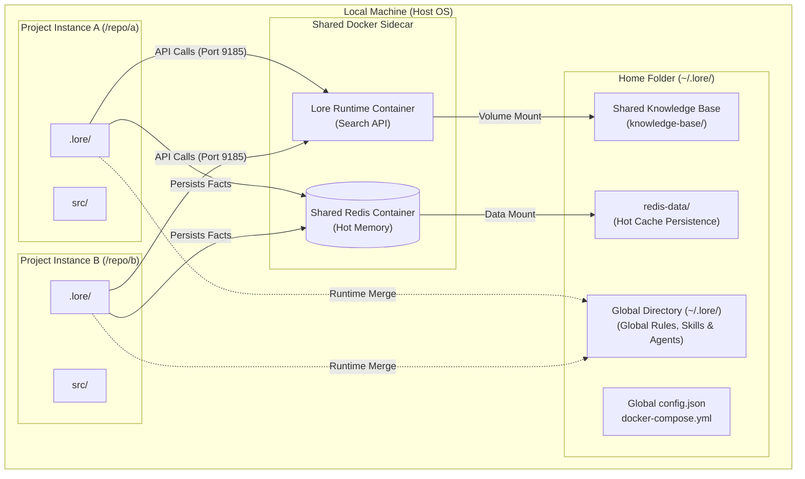

# Instance Topology

This diagram illustrates how Lore is installed on a machine and how multiple repository instances can share a single **Global Sidecar** and the **global `~/.lore/` directory**.

The global directory is the unified Knowledge Base -- shared across every project on the machine.

## Sharing Shared Services

1.  **Shared Redis (Hot Cache):** Redis data is mounted from `~/.lore/redis-data/`, making the hot cache part of the global directory's persistent state. All projects on the machine share the same Redis instance via the global sidecar (port 9185 by default). Facts learned in Project A gain heat and become available to the agent when working in Project B. Data survives container restarts because it lives in the global `~/.lore/` filesystem, not the container.
2.  **Shared KB (Global Directory):** The `~/.lore/knowledge-base/` directory is the machine-wide source of truth. The Shared Sidecar indexes this global folder, allowing the `lore_search` tool to return global fieldnotes and operator preferences regardless of which project is active.
3.  **The Harness Merge:** Even though the sidecar is shared, the **Harness** ensures that project-specific rules in `.lore/AGENTIC/rules/` take precedence over global ones, maintaining the correct context for each repository.
4.  **Global Directory Persistence:** Because the global directory is a Git repository in `~/`, your global knowledge (Rules, Skills, Agents, Knowledge Base) is version-controlled and persists even if you delete individual project repositories.
