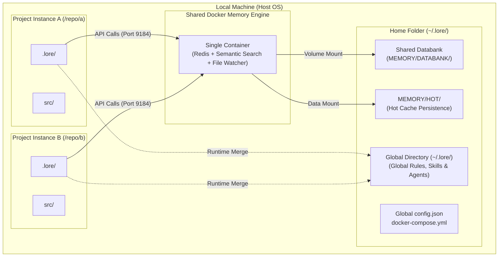

# Instance Topology

This diagram illustrates how Lore is installed on a machine and how multiple repository instances can share a single **Global Memory Engine** and the **global `~/.lore/` directory**.

The global directory is the unified databank — shared across every project on the machine.

## Sharing Shared Services

1.  **Shared Hot Memory:** Redis runs inside the memory engine container with data mounted from `~/.lore/MEMORY/HOT/`. All projects share the same memory engine (default `http://localhost:9184`). Facts learned in Project A gain heat and become available in Project B. Data survives container restarts because it lives in the global `~/.lore/` filesystem, not the container.
2.  **Shared Databank (Global Directory):** The `~/.lore/MEMORY/DATABANK/` directory is the machine-wide source of truth. The memory engine indexes this global folder, allowing the `lore_search` tool to return global fieldnotes and operator preferences regardless of which project is active.
3.  **The Harness Merge:** Even though the memory engine is shared, the composition engine ensures that project-specific rules in `.lore/AGENTIC/RULES/` take precedence over global ones, maintaining the correct context for each repository.
4.  **Global Directory Persistence:** The global directory (`~/.lore/`) persists even if you delete individual project repositories. You can optionally version it with Git for history tracking.
